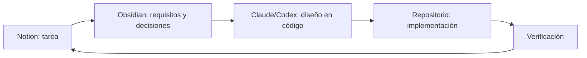

# MiDespensa — Centro del proyecto

> [!abstract] Propósito
> Punto de entrada para la documentación de MiDespensa y contexto principal para las personas y asistentes que trabajen en el proyecto.

## Enlaces externos

- [Proyecto y tareas en Notion](https://app.notion.com/p/3a1ad407cbfd81979530f32cc6669b0a)
- [Tablero de tareas — MiDespensa](https://app.notion.com/p/0136d6873c8e48d39e7af7a5d4a66c64)
La evidencia visual ejecutada se conserva en [[VISUAL-CONTEXT]].

### Diseño UI/UX

No se usa Figma para trabajo futuro. Claude y Codex diseñan directamente en el repositorio a partir de las especificaciones de Obsidian, implementan la propuesta y actualizan las capturas de [[VISUAL-CONTEXT]] para su revisión.

## Documentación principal

- [[WORKFLOW|Flujo de trabajo obligatorio]]
- [[ACTIVE-CONTEXT|Contexto y tarea activa]]
- [[VISUAL-CONTEXT|Contexto visual para modelos]]
- [[MASTER-IMPLEMENTATION-PLAN|Plan y trazabilidad de implementación]]
- [[PRODUCT-BRIEF|Visión y definición de producto]]
- [[MVP-FUNCTIONAL-BRIEF|Contrato funcional del MVP]]
- [[INFORMATION-ARCHITECTURE|Arquitectura de información minimalista]]
- [[ONBOARDING-WIREFLOW|Wireflow de onboarding e inventario inicial]]
- [[ONBOARDING-SCREEN-SPEC|Especificación detallada de pantallas del onboarding]]
- [[CORE-MVP-FLOWS-SPEC|Flujos principales del MVP]]
- [[PLAN-SCREEN-SPEC|Especificación de pantallas del plan semanal]]
- [[RECIPES-SCREEN-SPEC|Especificación de pantallas de recetas]]
- [[SHOPPING-SCREEN-SPEC|Especificación de pantallas de compra]]
- [[PANTRY-SCREEN-SPEC|Especificación de pantallas de despensa]]
- [[COMPETITIVE-BENCHMARK|Benchmark competitivo]]
- [[DOMAIN-DATA-MODEL|Modelo de dominio y datos]]
- [[TECHNICAL-ARCHITECTURE|Arquitectura técnica del MVP web]]
- [[adr/README|Registro de decisiones arquitectónicas]]

## Estructura del vault

| Carpeta | Propósito |
| --- | --- |
| `00-Project` | Hub, reglas de trabajo y contexto activo |
| `01-Product` | Visión, alcance, métricas y roadmap de producto |
| `02-Requirements` | Requisitos y criterios de aceptación |
| `03-UX` | Flujos, arquitectura de información y decisiones UX |
| `04-Research` | Investigación de mercado, competencia y evidencias externas |
| `05-Architecture` | Arquitectura técnica, dominio, datos y decisiones de infraestructura |

Se crearán nuevas carpetas únicamente cuando exista contenido canónico que lo justifique.

## Fuentes de verdad

| Información | Fuente principal | Contenido |
| --- | --- | --- |
| Trabajo | Notion | Tareas, estado, prioridad, responsable y dependencias |
| Diseño | Claude y Codex + `VISUAL-CONTEXT` | Propuesta UI/UX en código y capturas de la interfaz ejecutada |
| Conocimiento | Obsidian | Producto, requisitos, arquitectura, decisiones e investigación |
| Implementación | Repositorio | Código, pruebas, configuración y entregables ejecutables |

## Regla de enlace

Cada tarea de implementación en Notion debería enlazar:

1. la especificación o decisión correspondiente en Obsidian;
2. la evidencia visual de `VISUAL-CONTEXT` cuando tenga impacto UI/UX;
3. el entregable del repositorio cuando se implemente.

Una decisión importante tomada durante el diseño o desarrollo debe documentarse en Obsidian antes de considerar terminada la tarea de Notion.

## Flujo de trabajo

## Estado actual

- [x] Definición inicial del producto.
- [x] Contrato funcional preliminar.
- [x] Arquitectura de información minimalista.
- [x] Onboarding con inventario manual inicial confirmado.
- [x] Benchmark inicial de productos comparables.
- [x] Configurar gestión de tareas en Notion.
- [x] Abrir esta carpeta como vault de Obsidian.
- [x] Definir el modelo de dominio y datos.
- [x] Aprobar la arquitectura técnica del MVP web.
- [x] Establecer diseño UI/UX en código por Claude y Codex con evidencia en [[VISUAL-CONTEXT]].

## Convenciones documentales

- Una nota por decisión o tema estable.
- Wikilinks para relaciones internas.
- Enlaces web para Notion y fuentes externas; `VISUAL-CONTEXT` para evidencia de UI.
- Las hipótesis deben identificarse como pendientes de validar.
- Las decisiones confirmadas deben indicar su origen y fecha.
- No almacenar secretos, credenciales ni datos personales en las notas.
