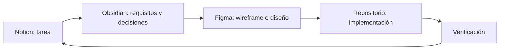

# MiDespensa — Centro del proyecto

> [!abstract] Propósito
> Punto de entrada para la documentación de MiDespensa y contexto principal para personas y modelos de IA.

## Enlaces externos

- [Proyecto y tareas en Notion](https://app.notion.com/p/3a1ad407cbfd81979530f32cc6669b0a)
- [Tablero de tareas — MiDespensa](https://app.notion.com/p/0136d6873c8e48d39e7af7a5d4a66c64)
- [Archivo maestro de wireframes y UI](https://www.figma.com/design/5OqgkhvJnvApXAxTD40a0Z)
- [Carpeta del proyecto en Figma](https://www.figma.com/files/team/908864607492859633/project/627408443)

## Documentación principal

- [[WORKFLOW|Flujo de trabajo obligatorio]]
- [[ACTIVE-CONTEXT|Contexto y tarea activa]]
- [[PRODUCT-BRIEF|Visión y definición de producto]]
- [[MVP-FUNCTIONAL-BRIEF|Contrato funcional del MVP]]
- [[INFORMATION-ARCHITECTURE|Arquitectura de información minimalista]]
- [[COMPETITIVE-BENCHMARK|Benchmark competitivo]]

## Estructura del vault

| Carpeta | Propósito |
| --- | --- |
| `00-Project` | Hub, reglas de trabajo y contexto activo |
| `01-Product` | Visión, alcance, métricas y roadmap de producto |
| `02-Requirements` | Requisitos y criterios de aceptación |
| `03-UX` | Flujos, arquitectura de información y decisiones UX |
| `04-Research` | Investigación de mercado, competencia y evidencias externas |

Se crearán nuevas carpetas únicamente cuando exista contenido canónico que lo justifique.

## Fuentes de verdad

| Información | Fuente principal | Contenido |
| --- | --- | --- |
| Trabajo | Notion | Tareas, estado, prioridad, responsable y dependencias |
| Diseño | Figma | Wireframes, flujos visuales, prototipos y componentes |
| Conocimiento | Obsidian | Producto, requisitos, arquitectura, decisiones e investigación |
| Implementación | Repositorio | Código, pruebas, configuración y entregables ejecutables |

## Regla de enlace

Cada tarea de implementación en Notion debería enlazar:

1. la especificación o decisión correspondiente en Obsidian;
2. el archivo o nodo de Figma cuando tenga impacto visual;
3. el entregable del repositorio cuando se implemente.

Una decisión importante tomada durante el diseño o desarrollo debe documentarse en Obsidian antes de considerar terminada la tarea de Notion.

## Flujo de trabajo

## Estado actual

- [x] Definición inicial del producto.
- [x] Contrato funcional preliminar.
- [x] Arquitectura de información minimalista.
- [x] Onboarding con inventario manual inicial confirmado.
- [x] Benchmark inicial de productos comparables.
- [x] Configurar gestión de tareas en Notion.
- [x] Crear archivo de wireframes en el proyecto de Figma.
- [x] Abrir esta carpeta como vault de Obsidian.
- [ ] Diseñar wireframes de baja fidelidad.

## Convenciones documentales

- Una nota por decisión o tema estable.
- Wikilinks para relaciones internas.
- Enlaces web para Notion, Figma y fuentes externas.
- Las hipótesis deben identificarse como pendientes de validar.
- Las decisiones confirmadas deben indicar su origen y fecha.
- No almacenar secretos, credenciales ni datos personales en las notas.
