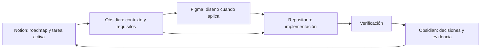

# MiDespensa — Flujo de trabajo

> [!important] Regla permanente
> Todo trabajo debe comenzar en una tarea de Notion y terminar actualizando Notion, después de registrar el conocimiento duradero y la verificación correspondiente.

## Secuencia obligatoria

## Antes de trabajar

- Abrir [el tablero de Notion](https://app.notion.com/p/0136d6873c8e48d39e7af7a5d4a66c64).
- Confirmar que existe una sola tarea en estado **En curso**.
- Abrir [[ACTIVE-CONTEXT]].
- Leer las notas enlazadas en la tarea activa.
- Revisar [Figma](https://www.figma.com/design/5OqgkhvJnvApXAxTD40a0Z) si la tarea es visual.

## Durante el trabajo

- Mantener el alcance de la tarea activa.
- Añadir decisiones estables a la nota canónica adecuada.
- Evitar crear notas para información temporal que pueda vivir en la tarea.
- Mantener referencias cruzadas solo cuando aporten navegación real.

## Al terminar

- Añadir criterios cumplidos y evidencia a la tarea.
- Actualizar la documentación afectada.
- Enlazar el nodo o archivo de Figma cuando exista.
- Enlazar el entregable del repositorio cuando exista.
- Cambiar el estado de Notion y activar la siguiente tarea solo cuando corresponda.
- Actualizar [[ACTIVE-CONTEXT]].

## Reglas de Notion

Notion debe mostrar siempre:

1. Roadmap detallado agrupado por fase.
2. Una única tarea activa identificable.
3. Estado, prioridad, tipo y fase de cada tarea.
4. Enlaces a la documentación necesaria de Obsidian.
5. Enlaces a Figma para tareas visuales.
6. Criterios de aceptación y dependencias dentro de cada tarea.

## Reglas de Obsidian

- Cada nota debe tener frontmatter, estado y enlaces coherentes.
- El hub debe permitir llegar a cualquier nota canónica.
- Una decisión se actualiza en su nota canónica; no se copia en varias notas.
- Una nota obsoleta se actualiza, reemplaza de forma explícita o archiva.
- No se crean carpetas vacías ni documentos de relleno.
- Los nombres de archivo deben ser estables, descriptivos y únicos.
- Desde Notion, los documentos locales se referencian mediante su ruta estable relativa al vault, por ejemplo `03-UX/INFORMATION-ARCHITECTURE.md`. No se depende de enlaces `obsidian://`, porque Notion puede eliminarlos o convertirlos en texto.

## Regla para modelos de IA

La secuencia mínima de lectura es:

1. [[ACTIVE-CONTEXT]]
2. [[00-MiDespensa-Hub]]
3. Documentos enlazados por la tarea activa

No es necesario cargar todo el vault para cada tarea.
