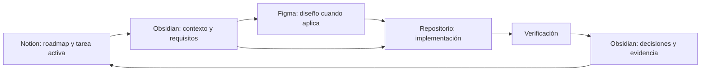

# MiDespensa — Flujo de trabajo

> [!important] Regla permanente
> Todo trabajo debe comenzar en una tarea de Notion y terminar actualizando Notion, después de registrar el conocimiento duradero y la verificación correspondiente.

## Secuencia obligatoria

## Antes de trabajar

- Abrir [el tablero de Notion](https://app.notion.com/p/0136d6873c8e48d39e7af7a5d4a66c64).
- Confirmar que existe como máximo una tarea en estado **En curso** por carril habilitado. Actualmente se permiten los carriles UX/UI y Arquitectura para trabajar en paralelo sin mezclar alcance.
- Abrir [[ACTIVE-CONTEXT]].
- Leer las notas enlazadas en la tarea activa del carril en el que se va a trabajar.
- Revisar [Figma](https://www.figma.com/design/mq6mzlMD6bsiKy9HKnrkih) si la tarea es visual.
- Para MiDespensa, usar únicamente el [proyecto Figma 627466188](https://www.figma.com/files/project/627466188) y sus archivos; no crear ni editar diseños fuera de él.

## Durante el trabajo

- Mantener el alcance de la tarea activa del carril correspondiente.
- Añadir decisiones estables a la nota canónica adecuada.
- Evitar crear notas para información temporal que pueda vivir en la tarea.
- Mantener referencias cruzadas solo cuando aporten navegación real.

## Preferencias de desarrollo

- No ejecutar por iniciativa propia `test`, `test:e2e`, `lint`, `typecheck` ni `build`; la verificación manual queda a cargo de la persona responsable hasta que se solicite expresamente.
- Mantener la futura automatización E2E como trabajo planificado, sin sustituirla por ejecuciones automáticas ad hoc durante el desarrollo.
- La ruta raíz de desarrollo debe mostrar el flujo real de la aplicación: autenticación, onboarding o área principal según el estado de sesión; no páginas temporales.
- En `next dev`, la autenticación y las redirecciones por onboarding se omiten temporalmente para revisar la interfaz local sin credenciales. Esta excepción debe limitarse a `NODE_ENV=development`; producción conserva Auth y RLS.

## Al terminar

- Añadir criterios cumplidos y evidencia a la tarea.
- Actualizar la documentación afectada.
- Enlazar el nodo o archivo de Figma cuando exista.
- Enlazar el entregable del repositorio cuando exista.
- Cambiar el estado de Notion y activar la siguiente tarea solo cuando corresponda.
- Actualizar [[ACTIVE-CONTEXT]].

## Reglas de Notion

Notion debe mostrar siempre:

1. Roadmap detallado agrupado por fase.
2. Una única tarea activa identificable por cada carril habilitado.
3. Estado, prioridad, tipo y fase de cada tarea.
4. Enlaces a la documentación necesaria de Obsidian.
5. Enlaces a Figma para tareas visuales.
6. Criterios de aceptación y dependencias dentro de cada tarea.

## Reglas de Obsidian

- Cada nota debe tener frontmatter, estado y enlaces coherentes.
- El hub debe permitir llegar a cualquier nota canónica.
- Una decisión se actualiza en su nota canónica; no se copia en varias notas.
- Una nota obsoleta se actualiza, reemplaza de forma explícita o archiva.
- No se crean carpetas vacías ni documentos de relleno.
- Los nombres de archivo deben ser estables, descriptivos y únicos.
- Desde Notion, los documentos locales se referencian mediante su ruta estable relativa al vault, por ejemplo `03-UX/INFORMATION-ARCHITECTURE.md`. No se depende de enlaces `obsidian://`, porque Notion puede eliminarlos o convertirlos en texto.

## Regla para modelos de IA

La secuencia mínima de lectura es:

1. [[ACTIVE-CONTEXT]]
2. [[00-MiDespensa-Hub]]
3. Documentos enlazados por la tarea activa del carril correspondiente

No es necesario cargar todo el vault para cada tarea.

## Planes de integración: Fable 5 + Codex

Cuando se comparta un plan de integración (por ejemplo, esta integración con Obsidian):

1. **Fable 5** actúa como jefe planificador y revisor.
2. La implementación se delega a **Codex** (plugin `codex@openai-codex`), usando el modelo **Terra 5.6** (`gpt-5.6-terra`) con **esfuerzo medio**. Atención: `~/.codex/config.toml` tiene `gpt-5.6-sol` como valor por defecto, así que el modelo debe pasarse explícitamente al lanzar cada tarea.
3. Al terminar Codex, Fable 5 revisa el resultado y se comunica con Codex en bucle, pidiendo ajustes, hasta aprobar el trabajo. La tarea no se cierra sin esa aprobación explícita.
