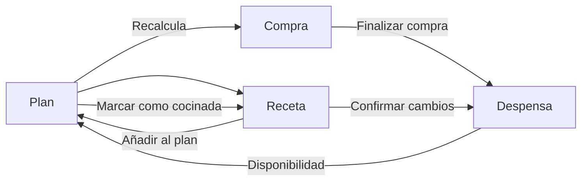

# Flujos principales del MVP — MiDespensa

## Propósito

Definir el uso habitual posterior al onboarding para decidir qué comer, encontrar recetas, comprar y corregir existencias sin saltar entre módulos inconexos.

## Estado de implementación

Los flujos F1–F4 están implementados en el repositorio hasta la revisión de cocina y consumo asistido. Esta nota describe el comportamiento objetivo y vigente; su aceptación integral y la validación responsive siguen pendientes de la Fase 9. La captura de tickets (C4) queda explícitamente fuera de los flujos implementados.

## Regla de navegación

Los cuatro destinos son **Plan**, **Recetas**, **Compra** y **Despensa**. Plan es la entrada habitual; no existe un dashboard adicional.

La navegación conserva nombres, orden y acciones en móvil, tablet y escritorio. Solo cambia la distribución.

## F1 — Planificar la semana

| Estado | Contenido | Acción principal |
| --- | --- | --- |
| Semana actual | Siete días; comida y cena | Añadir en un hueco vacío |
| Elegir receta | Sugerencias primero, búsqueda después | Añadir al plan |
| Hueco planificado | Receta, raciones y menú contextual | Marcar como cocinada |
| Semana incompleta | Huecos pendientes y sugerencias | Completar con sugerencias |

- Solo comida y cena; no hay calendario mensual en el MVP.
- **Añadir** abre las sugerencias contextualizadas para ese día y servicio.
- Las sugerencias priorizan disponibilidad aproximada, productos a priorizar, variedad, tiempo y criterio mediterráneo; explican su primer motivo y muestran si faltan productos.
- Las sugerencias se calculan automáticamente, pero solo ordenan recetas guardadas por el hogar mediante reglas explicables; no crean recetas nuevas ni completan el plan sin decisión del usuario.
- Se muestran exactamente tres sugerencias. Si una receta tiene faltantes, al elegirla sus productos se consolidan en la sección **Para el plan** de Compra.
- Elegir una receta actualiza el hueco y recalcula Compra sin interrumpir.
- Duplicar, mover o eliminar una planificación permanecen en el menú contextual.

## F2 — Gestionar y cocinar recetas

| Estado | Contenido | Acción principal |
| --- | --- | --- |
| Biblioteca | Búsqueda y lista | Añadir receta |
| Crear / editar | Datos básicos, ingredientes y pasos | Guardar receta |
| Detalle | Raciones, tiempo, ingredientes y pasos | Añadir al plan |
| Receta planificada | Confirmación de cocina | Marcar como cocinada |
| Cambios propuestos | Ingredientes conocidos y correcciones | Confirmar cambios |

- La biblioteca muestra búsqueda y lista; filtros, etiquetas y enlace original aparecen solo cuando se necesitan.
- Se puede guardar una receta incompleta y completarla después.
- Ajustar raciones afecta a la receta usada en el plan, no a la original.
- Marcar como cocinada nunca descuenta existencias en silencio: abre la propuesta de cambios de Despensa.

## F3 — Comprar y actualizar la despensa

| Estado | Contenido | Acción principal |
| --- | --- | --- |
| Lista activa | Ingredientes consolidados y productos manuales | Marcar productos |
| En compra | Pendientes y progreso discreto | Finalizar compra |
| Revisión de entradas | Productos marcados y cambios propuestos | Confirmar en despensa |
| Lista vacía | Explicación breve | Añadir producto |

- La lista es única y compartida; el campo de producto manual siempre está visible.
- La cantidad es opcional y no bloquea añadir un producto.
- Supermercados, edición avanzada y compras previas permanecen ocultos hasta solicitarlos.
- Finalizar compra solo aparece cuando existe algún producto marcado.
- Ninguna entrada actualiza Despensa antes de la revisión y confirmación.

## F4 — Mantener la despensa

| Estado | Contenido | Acción principal |
| --- | --- | --- |
| Lista priorizada | Búsqueda, estado y productos que requieren atención | Añadir producto |
| Detalle | Tipo de seguimiento, cantidad opcional, unidad, entradas y movimientos | Guardar cambios |
| Corrección rápida | Queda poco / Se terminó / Ajustar unidades cuando corresponda | Aplicar corrección |
| Vacío / sin resultados | Explicación breve | Añadir producto |

- La lista prioriza atención antes que orden alfabético.
- **Se terminó** elimina la presencia y ofrece añadir el producto a Compra con **Deshacer**.
- Cada producto usa uno de tres tipos: unidades exactas, peso o volumen, o presencia aproximada. El contador rápido solo aparece para unidades exactas; no se fuerzan cantidades para los demás.
- Cantidad, unidad, fecha de entrada, movimientos y recetas relacionadas viven en detalle, salvo el contador compacto de unidades exactas.
- Añadir manualmente y confirmar una compra actualizan la misma fuente de datos.

## Adaptación responsive

| Contexto | Navegación | Distribución | Regla |
| --- | --- | --- | --- |
| Móvil, 320–599 px | Barra inferior con cuatro destinos | Una columna | CTA visible y controles ≥44 px |
| Tablet, 600–1023 px | Misma navegación y términos | Una o dos columnas | Lista y detalle conviven solo si evitan navegación repetida |
| Escritorio, ≥1024 px | Barra lateral compacta | Contenido limitado; dos paneles en Recetas y Despensa cuando aporte valor | Ninguna función depende de hover |

Plan conserva una semana legible en todos los tamaños. Compra conserva una sola lista. Recetas y Despensa pueden usar lista y detalle en paralelo en escritorio; en móvil se abren de forma secuencial.

## Estados compartidos

- **Vacío:** explica el siguiente paso y ofrece una sola CTA.
- **Sincronizando:** estado discreto sin bloquear lectura.
- **Error / sin conexión:** conserva lo visible, identifica el cambio pendiente y permite reintentar.
- **Cambio reversible:** eliminación, corrección y entrada desde Compra ofrecen **Deshacer**.
- **Colaboración:** cambios de otro miembro no sustituyen un formulario activo ni borran una edición local.

## Criterios de aceptación

### UX-CORE-001 — Planificación contextual

Al pulsar **Añadir** en una comida o cena se abre la selección contextualizada; al elegir una receta solo se actualiza ese hueco y se recalcula Compra. Verificación: revisión manual en móvil y escritorio.

### UX-CORE-002 — Receta sin fricción

Se puede guardar una receta incompleta, reabrirla y añadirla al plan. Verificación: prueba funcional manual.

### UX-CORE-003 — Compra verificable

Finalizar una compra obliga a revisar los productos que entrarán en Despensa antes de confirmar. No se aceptan actualizaciones silenciosas. Verificación: prueba C1 → C3.

### UX-CORE-004 — Corrección ligera

Desde una fila de Despensa, **Se terminó** actualiza presencia y permite añadir el producto a Compra sin abrir un formulario completo. Verificación: prueba manual con Deshacer.

### UX-CORE-005 — Un único modelo mental

Destinos, acciones y datos se mantienen entre móvil, tablet y escritorio; solo cambian navegación y distribución. Verificación: comparación de wireframes a 390, 768 y 1440 px.

## Fuera de alcance

- Lectura automática de tickets y recetas en estos flujos iniciales, comparación de precios, presupuesto y nutrición detallada.
- Calendario mensual y analítica persistente.
- Comunidad, recetas públicas y comentarios.
- Automatismos que modifiquen la despensa sin confirmación.
