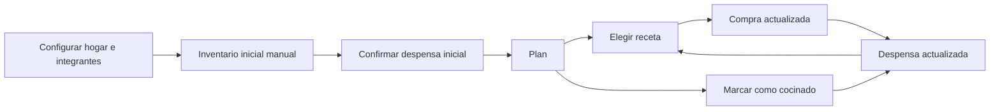

# Arquitectura de información minimalista — MiDespensa

**Estado:** Propuesta revisada para validación  
**Revisión:** 2  
**Fecha:** 18 de julio de 2026

## 1. Objetivo

Ofrecer una web adaptable para móvil, tablet y escritorio en la que el usuario pueda planificar, comprar y actualizar la despensa con el menor número posible de decisiones y acciones visibles.

## 2. Requisitos confirmados

- Interfaz minimalista y concreta.
- Web adaptable, diseñada primero para móvil.
- Uso cómodo también en tablet y escritorio.
- Sin botones, apartados ni funciones que no ayuden a completar la tarea actual.
- Recetas, planificación, compra y despensa conectadas en un único flujo.
- Sugerencias de platos con decisión final del usuario.
- Creación del hogar y sus integrantes seguida de un informe manual inicial de alimentos.
- Revisión del inventario inicial por frigorífico, congelador y despensa o armario.

## 3. Decisión de diseño recomendada

La aplicación tendrá cuatro destinos principales:

1. **Plan** — qué vamos a comer.
2. **Recetas** — qué podemos cocinar.
3. **Compra** — qué necesitamos.
4. **Despensa** — qué tenemos.

**Plan será la pantalla inicial.** No habrá un Inicio o panel de control independiente en el MVP.

El perfil, los miembros del hogar y los ajustes se abrirán desde un único acceso secundario en la cabecera. No ocuparán espacio en la navegación diaria.

## 4. Mapa reducido

No se crearán pantallas separadas para procesos que puedan resolverse dentro del contexto actual.

## 5. Onboarding obligatorio

La navegación principal permanecerá oculta hasta completar o reanudar el informe inicial.

### Paso 1 — Hogar e integrantes

- nombre del hogar precompletado y editable;
- usuario actual incluido automáticamente;
- otras personas definidas solo mediante nombre o apodo;
- el número habitual de personas se deriva inicialmente de los integrantes;
- invitaciones, acceso y permisos se resuelven después del onboarding;
- una sola acción: **Preparar mi despensa**.

### Paso 2 — Alimentos disponibles

La revisión se divide en tres zonas comprensibles:

1. frigorífico;
2. congelador;
3. despensa o armario.

En cada zona se ofrece:

- búsqueda y adición rápida;
- selección de alimentos comunes;
- estado “hay” como valor predeterminado;
- cantidad opcional dentro del producto, no en el flujo principal;
- acción **No tengo nada aquí** para completar una zona vacía;
- progreso visible, por ejemplo “2 de 3”.

El progreso se guarda después de cada cambio. Si el usuario sale, regresará a la misma zona sin perder información.

### Paso 3 — Revisión

- resumen agrupado por zona;
- edición directa de errores;
- una acción principal: **Confirmar despensa**.

Tras confirmar, el hogar queda inicializado y se ofrece una única pantalla transitoria con:

- acción principal **Añadir mi primera receta**;
- acción secundaria **Ir al plan**.

La carga de tickets solo aparecerá cuando esa capacidad esté disponible y no formará parte de esta pantalla inicial.

Esta pantalla aparece una vez y no se convierte en un dashboard permanente.

## 6. Flujo principal

### 1. Planificar

- La aplicación abre en la semana actual.
- Cada día muestra únicamente comida y cena.
- Un hueco vacío contiene una acción: **Añadir**.
- Al pulsarla aparecen primero varias sugerencias y después la búsqueda de recetas.
- Al elegir una receta, el hueco queda planificado y la compra se recalcula automáticamente.

### 2. Comprar

- Compra muestra una única lista activa compartida.
- Los productos se marcan con una pulsación.
- Se pueden añadir productos manuales desde un campo visible.
- La organización por supermercado será opcional y permanecerá oculta hasta utilizarla.
- Al terminar, una sola acción permite revisar y confirmar lo que entra en la despensa.

### 3. Cocinar

- Al abrir una comida planificada se muestra la receta.
- La acción principal es **Marcar como cocinada**.
- El sistema presenta los cambios propuestos en la despensa.
- El usuario confirma o corrige; no hay descuento silencioso.

### 4. Corregir existencias

- Despensa muestra una única lista, ordenando primero lo que requiere atención.
- Cada producto permite indicar rápidamente **queda poco** o **se terminó**.
- Al marcar “se terminó”, se ofrece añadirlo a Compra.
- La cantidad exacta y el historial estarán disponibles en el detalle, no en la vista principal.

## 7. Contenido mínimo de cada destino

### Plan

Visible:

- semana actual;
- navegación a semana anterior o siguiente;
- comida y cena de cada día;
- acción Añadir en huecos vacíos;
- acción contextual para marcar una receta como cocinada.

Oculto hasta necesitarlo:

- selector de fecha;
- duplicar semana;
- cambiar raciones;
- eliminar o mover una planificación.

No incluido inicialmente:

- calendario mensual completo;
- estadísticas de planificación;
- panel de equilibrio nutricional permanente.

### Recetas

Visible:

- búsqueda;
- lista de recetas;
- una acción principal: **Añadir receta**.

Oculto hasta necesitarlo:

- filtros;
- edición;
- enlace original;
- etiquetas y datos secundarios.

En el detalle de una receta, la acción principal será **Añadir al plan**.

### Compra

Visible:

- lista activa;
- casillas de productos;
- campo para añadir un producto;
- progreso discreto;
- acción **Finalizar compra** cuando haya productos marcados.

Oculto hasta necesitarlo:

- asignación de supermercado;
- edición de cantidad;
- eliminar o desmarcar todos;
- compras anteriores.

### Despensa

Visible:

- búsqueda;
- lista priorizada;
- estado de cada producto;
- una acción principal: **Añadir producto**.

Oculto hasta necesitarlo:

- cantidad y unidad;
- fecha de entrada;
- movimientos;
- corrección avanzada;
- recetas relacionadas.

## 8. Acciones transversales

Para evitar botones repetidos:

- no habrá un botón global de creación;
- cada destino tendrá como máximo una acción principal visible;
- las acciones sobre un elemento aparecerán al abrirlo o mediante un menú contextual;
- las acciones destructivas permanecerán dentro del detalle y exigirán confirmación;
- los cambios recientes importantes permitirán deshacer desde un aviso breve.

## 9. Adaptación por dispositivo

### Móvil

- navegación inferior con cuatro destinos y texto visible;
- una sola columna;
- controles táctiles de al menos 44 × 44 píxeles;
- formularios y confirmaciones en paneles inferiores cuando sean breves;
- sin acciones que dependan de pasar el cursor.

### Tablet

- misma estructura y terminología que en móvil;
- mayor ancho para mostrar el contenido sin añadir funciones;
- dos paneles solo cuando eviten navegación repetida, por ejemplo lista y detalle de receta.

### Escritorio

- navegación lateral compacta con los mismos cuatro destinos;
- contenido con ancho limitado para evitar líneas y listas excesivamente largas;
- dos paneles en recetas o despensa cuando resulte útil;
- atajos de teclado como mejora posterior, no requisito del MVP.

La interfaz cambiará de distribución, no de modelo mental.

## 10. Presupuesto de complejidad

Cada pantalla respetará estas reglas:

- una acción principal visible;
- como máximo una acción secundaria visible;
- no más de cuatro destinos principales;
- sin carruseles, widgets configurables ni paneles de métricas en el MVP;
- sin iconos ambiguos sin texto en la navegación;
- sin pedir información que pueda aplazarse;
- sin animación ornamental en acciones frecuentes;
- confirmaciones solo para cambios difíciles de deshacer o que afecten a existencias.

## 11. Estados simples

Cada área necesita únicamente cuatro estados comprensibles:

1. **Vacío:** explica en una frase para qué sirve y ofrece una acción.
2. **Con contenido:** muestra la tarea principal sin instrucciones adicionales.
3. **Necesita atención:** señala datos antiguos, incompletos o prioritarios sin bloquear.
4. **Error:** explica qué ocurrió, conserva el trabajo y permite reintentar.

Los cambios realizados por otro miembro se incorporarán sin crear una pantalla de actividad. Solo se indicará la autoría cuando ayude a comprender un cambio reciente.

## 12. Criterios de validación

El flujo será suficientemente simple si, desde Plan, un usuario puede:

- añadir una receta a un hueco en un máximo de tres decisiones;
- llegar a Compra con una sola selección en la navegación;
- marcar un producto comprado con una pulsación;
- finalizar la compra con una acción y una revisión;
- marcar una receta como cocinada con una acción y una confirmación;
- actualizar “queda poco” o “se terminó” desde el producto sin editar un formulario;
- comprender los cuatro destinos sin explicación previa;
- utilizar las mismas palabras y el mismo flujo en móvil, tablet y escritorio.

El onboarding será suficientemente simple si el usuario puede:

- entender que está creando la despensa inicial sin leer instrucciones extensas;
- añadir varios alimentos seguidos sin abrir un formulario por cada uno;
- completar una zona vacía con una acción;
- omitir cantidades y caducidades;
- salir y continuar desde el mismo punto;
- revisar y corregir antes de confirmar.

La validación se hará con un prototipo de baja fidelidad antes de diseñar el aspecto visual definitivo.

## 13. Elementos eliminados respecto a la revisión anterior

- Inicio o dashboard independiente.
- Actividad reciente como bloque visible.
- Indicadores permanentes de cobertura del hogar.
- Vista mensual completa en el MVP.
- Múltiples vistas internas por sección.
- Historiales y configuración avanzada en primer nivel.
- Botones globales y accesos rápidos duplicados.
- Pantallas independientes para acciones que caben en un panel breve.
