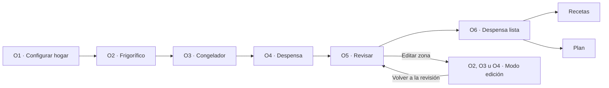

# Especificación de pantallas — Onboarding e inventario inicial

## 1. Propósito

Definir el flujo completo, la composición y el comportamiento de las seis pantallas aprobadas antes de crear wireframes en Figma. Este documento es el contrato de diseño para el camino principal, sus estados alternativos y su adaptación responsive.

## 2. Alcance

### Incluido

- configuración inicial del hogar y personas que lo forman;
- revisión de frigorífico, congelador y despensa;
- captura rápida, productos personalizados y detección de duplicados;
- zonas vacías, eliminación y deshacer;
- guardado local, sincronización, reanudación y errores;
- revisión y confirmación de la línea base;
- pantalla de finalización y salida a Recetas o Plan;
- comportamiento móvil, tablet y escritorio;
- teclado, foco, lectores de pantalla y movimiento reducido.

### Fuera de alcance

- mecanismo de registro o inicio de sesión;
- envío y aceptación de invitaciones;
- permisos de integrantes;
- cantidades, unidades y caducidades durante el onboarding;
- lectura automática de recetas o tickets durante el onboarding y recomendaciones fuera de su contexto;
- identidad visual, paleta, tipografía de marca e ilustraciones;
- navegación habitual de la aplicación.

## 3. Flujo aprobado



La navegación principal permanece oculta hasta confirmar la línea base. O6 se muestra una sola vez; los accesos posteriores abren Plan.

## 4. Modelo de estado

### Estado global

`household_draft → inventory_in_progress → awaiting_review → confirming → completed`

### Estado de cada zona

`not_started → in_progress → reviewed_nonempty | reviewed_empty`

Reglas:

- añadir un alimento no marca la zona como revisada;
- una zona con contenido se revisa al pulsar su CTA;
- una zona sin contenido se revisa al declararla vacía;
- si se elimina el último alimento de una zona revisada, vuelve a `in_progress`;
- añadir un alimento elimina automáticamente el estado `reviewed_empty`;
- la línea base puede contener cero alimentos si las tres zonas fueron declaradas vacías.

### Datos que deben persistirse

- borrador del nombre del hogar y personas añadidas;
- estado global y estado de cada zona;
- zona activa;
- alimentos y productos personalizados por zona;
- destino de retorno al editar desde O5;
- cambios locales pendientes de sincronizar;
- identificador idempotente de confirmación;
- confirmación final reconocida por el servidor.

## 5. Contrato de navegación

| Pantalla | Entrada | Avance | Condición | Atrás | Reanudación |
| --- | --- | --- | --- | --- | --- |
| O1 | Inicio nuevo o borrador de hogar | O2 | Nombre válido y hogar creado en servidor | Sale del onboarding conservando borrador | O1 restaurada |
| O2 | Hogar creado o edición desde O5 | O3 o O5 | Alimentos y CTA, o zona declarada vacía | O1; en edición, O5 | O2 |
| O3 | Frigorífico revisado o edición | O4 o O5 | Igual que O2 | O2; en edición, O5 | O3 |
| O4 | Zonas anteriores revisadas o edición | O5 | Igual que O2 | O3; en edición, O5 | O4 |
| O5 | Tres zonas revisadas | O6 | Todo sincronizado y confirmación remota válida | O4 | O5 |
| O6 | Confirmación remota completada | Recetas o Plan | Onboarding `completed` | No vuelve a O5 | Accesos posteriores abren Plan |

Un enlace directo nunca permite saltarse requisitos. O5 con zonas pendientes redirige a la primera zona pendiente; O6 sin confirmación redirige a O5. Tras completar, O1–O5 redirigen a Plan.

## 6. Estructura global

```text
OnboardingShell
├── StepHeader
├── MainContent
│   └── contenido específico de pantalla
├── SaveStatus o SyncBanner
└── ActionFooter
    ├── acción secundaria opcional
    └── PrimaryButton
```

### Reglas del shell

- altura mínima `100dvh` y respeto de áreas seguras;
- una única región de scroll;
- cabecera y pie no pueden ocultar contenido, errores ni foco;
- el pie es persistente en móvil cuando haya espacio seguro;
- al abrirse el teclado, el pie puede compactarse o dejar de ser flotante para no tapar resultados;
- la acción principal ocupa el ancho disponible en móvil;
- no hay navegación principal, dashboard ni botón global de creación.

### Orden DOM común de O2–O4

`Volver → progreso → sincronización → H1 → ayuda → combobox → resultados → sugerencias → añadidos/acción vacía → CTA`

La redistribución de escritorio conserva este orden aunque visualmente use dos columnas.

## 7. O1 — Configurar hogar

### Objetivo

Crear un hogar válido y definir quién vive en él sin convertir nombres en cuentas ni invitaciones.

### Jerarquía y microcopy

1. H1: **Organiza la comida de casa**.
2. Ayuda: `Ten a mano lo que tienes, tus recetas y el plan de la semana.`
3. Campo `Nombre del hogar`, valor inicial `Mi hogar`.
4. Sección `Personas del hogar`.
5. Fila automática `Tú`.
6. Acción secundaria `Añadir otra persona`.
7. CTA `Preparar mi despensa`.

Al añadir una persona:

- campo `Nombre o apodo`;
- ayuda `No le dará acceso a la aplicación todavía.`;
- acciones locales `Añadir` y `Cancelar`;
- Enter añade; Escape cancela;
- el foco vuelve a `Añadir otra persona` después del alta.

### Composición

- móvil y tablet: promesa, formulario y personas en una columna;
- escritorio: promesa a la izquierda y formulario a la derecha en proporción aproximada 40/60;
- con una o dos personas debe caber sin scroll en 390 × 844 px;
- con más personas o a 320 × 568 px se permite scroll sin mover el CTA sobre los campos.

### Estados

- **Inicial:** `Mi hogar` y `Tú` precompletados; CTA disponible.
- **Alta abierta:** nuevo campo inline; la CTA no puede enviar una persona incompleta.
- **Nombre de hogar vacío:** `Escribe un nombre para el hogar.`
- **Persona incompleta:** `Escribe un nombre o elimina esta persona.`
- **Eliminación:** `{nombre} eliminado del hogar · Deshacer`.
- **Creación en curso:** botón ocupado, sin doble envío.
- **Error de red:** `No hemos podido crear el hogar. Tus datos siguen aquí.` + `Reintentar`; no avanzar a O2.

### Accesibilidad y foco

Orden: H1 al entrar → nombre del hogar → añadir persona → campos y botones Quitar → CTA. El botón de eliminación se llama `Quitar a {nombre} del hogar`.

### Salida

El hogar se crea únicamente al activar la CTA. La operación debe ser idempotente: doble pulsación o reintento no crea dos hogares.

## 8. O2 — Frigorífico

### Objetivo

Registrar rápidamente lo visible en el frigorífico y enseñar una sola vez el patrón que se repetirá.

### Jerarquía y microcopy

1. `Inventario: 1 de 3`.
2. H1: **Frigorífico**.
3. Ayuda: `Indica qué tienes. No necesitas añadir cantidades ni caducidades.`
4. Campo `Añade un alimento`; ejemplo `Ej.: leche`.
5. Sección `Alimentos habituales` con 6–8 sugerencias.
6. Sección dinámica `Añadidos ({n})`.
7. Con cero alimentos: `Mi frigorífico está vacío`.
8. CTA: `Seguir con el congelador`.
9. Si no puede avanzar: `Añade al menos un alimento o marca el frigorífico como vacío.`

### Composición

- cabecera con Volver, progreso y estado de sincronización;
- título y ayuda;
- combobox y resultados de hasta cinco filas visibles;
- chips flexibles, nunca carrusel;
- lista de seleccionados con filas de 56–64 px;
- pie persistente con CTA;
- el buscador puede quedar adherido al borde superior al desplazar una lista larga.

### Interacciones

- Enter o pulsación añade el resultado activo;
- tras añadir se limpia el campo y conserva el foco;
- sin coincidencias aparece `Añadir «{texto}»`;
- un duplicado anuncia `{alimento} ya estaba añadido` y resalta la fila sin mover el foco;
- cada fila expresa `{alimento}, hay` y ofrece `Quitar {alimento} del frigorífico`;
- quitar muestra `{alimento} eliminado · Deshacer`;
- la CTA se mantiene enfocable con `aria-disabled=true` mientras falte completar la zona.

### Zona vacía

La acción solo existe con cero alimentos. Al activarla:

1. la zona pasa a `reviewed_empty`;
2. se abre O3;
3. O3 muestra `Frigorífico marcado como vacío · Deshacer`;
4. Deshacer restaura la zona, vuelve a O2 y enfoca el H1.

### Estados

- inicial vacío;
- escribiendo y resultados abiertos;
- sin coincidencias y alta personalizada;
- varios alimentos añadidos;
- duplicado;
- CTA no disponible con explicación;
- guardado local pendiente de sincronizar;
- reanudación con `Seguimos donde lo dejaste`;
- error local que impide conservar cambios.

### Salida

Una zona con alimentos pasa a `reviewed_nonempty` al pulsar la CTA. Añadir el primer alimento no la completa automáticamente.

## 9. O3 — Congelador

### Objetivo

Aplicar el patrón aprendido sin volver a explicarlo.

### Diferencias respecto a O2

- progreso `Inventario: 2 de 3`;
- H1 **Congelador**;
- ejemplo `Ej.: pollo`;
- sugerencias propias de congelador;
- acción vacía `Mi congelador está vacío`;
- CTA `Seguir con la despensa`;
- Volver se llama `Volver al frigorífico`.

Composición, captura, duplicados, eliminación, guardado y accesibilidad son idénticos a O2. La estabilidad espacial entre las tres zonas es un criterio de diseño.

El toast heredado de una zona vacía se muestra sobre el pie sin empujar la composición ni robar foco.

## 10. O4 — Despensa

### Objetivo

Registrar la zona previsiblemente más extensa sin añadir categorías ni formularios.

### Diferencias respecto a O2

- progreso `Inventario: 3 de 3`;
- H1 **Despensa**;
- ayuda `Incluye los armarios donde guardas comida.`;
- ejemplo `Ej.: arroz`;
- acción vacía `Mi despensa está vacía`;
- CTA `Revisar lo que tengo`;
- Volver se llama `Volver al congelador`.

### Densidad y scroll

- mostrar una lista continua, no categorías obligatorias;
- el wireframe debe probar al menos seis filas y contenido adicional fuera del primer viewport;
- el buscador adherido no tapa el primer resultado;
- el pie no tapa la última fila;
- se prefiere un único scroll de página también en escritorio.

### Modo edición desde O5

- cabecera contextual `Editando despensa`, `Editando frigorífico` o `Editando congelador`;
- CTA `Volver a la revisión`;
- Volver también conduce a O5;
- `return_target=review` se conserva tras recargar;
- si queda sin alimentos y no se declara vacía, vuelve a `in_progress` y O5 la muestra pendiente.

## 11. O5 — Revisión

### Objetivo

Permitir comprobar y corregir la línea base antes de convertirla en estado compartido del hogar.

### Jerarquía y microcopy

1. Sobretexto `Revisión`.
2. H1: **Revisa tu despensa**.
3. Ayuda: `Puedes corregir cualquier zona antes de terminar.`
4. Resumen de Frigorífico.
5. Resumen de Congelador.
6. Resumen de Despensa.
7. Ayuda: `Podrás cambiar estos alimentos después.`
8. CTA: `Confirmar despensa`.

Cada resumen contiene:

- `{Zona} · {n} alimentos` o `{Zona} · Vacía`;
- hasta dos ejemplos y `y {n} más`;
- botón específico `Editar {zona}`.

La fila no es además un segundo enlace; existe un único objetivo para editar.

### Composición

- móvil/tablet: tres filas apiladas;
- escritorio: tres tarjetas iguales en una cuadrícula;
- no se muestra `4 de 3` ni una barra porcentual;
- las tres zonas y la CTA deberían caber en 390 × 844 px con texto normal;
- con zoom o texto ampliado, el contenido desplaza de forma natural.

### Estados

- tres zonas con productos;
- combinación de zonas con productos y vacías;
- las tres zonas vacías, que sigue siendo una línea base válida;
- una zona `Sin revisar` tras editar: CTA no disponible y acción `Revisar`;
- cambios locales pendientes: banner persistente, revisión disponible, confirmación bloqueada;
- confirmación en curso: `Confirmando despensa…`, solo CTA ocupada;
- error: `No hemos podido confirmar la despensa. Tus alimentos siguen guardados.` + `Reintentar`.

### Sincronización y confirmación

O2–O4 pueden continuar con una copia local persistente. O5 no completa el onboarding hasta que todos los cambios estén sincronizados. Al reconectar se sincroniza automáticamente y se habilita la confirmación.

La confirmación es remota e idempotente. O6 solo aparece tras recibir confirmación del servidor y sustituye O5 en el historial para evitar una segunda línea base.

## 12. O6 — Despensa lista

### Objetivo

Confirmar el logro y conducir a una acción útil sin convertir la pantalla en un dashboard.

### Jerarquía y microcopy

1. Indicador de finalización neutro, decorativo.
2. H1: **Tu despensa está lista**.
3. Con alimentos: `Hemos guardado {n} alimentos.`
4. Ayuda: `Esta información nos ayudará a planificar y preparar la compra.`
5. CTA: `Añadir mi primera receta`.
6. Acción secundaria: `Ir al plan`.

Variante con cero alimentos:

- `Has indicado que ahora no tienes alimentos guardados.`
- `Puedes añadirlos después desde Despensa o empezar con una receta.`

### Composición

- contenedor de 520–600 px como máximo;
- alineación inicial a la izquierda en móvil;
- espacio flexible para situar acciones al final sin superponerlas;
- no mostrar métricas, recomendaciones, tickets ni accesos adicionales;
- H1 recibe el foco al entrar; no se enfoca automáticamente la CTA.

### Salida

- CTA abre el flujo de creación de receta;
- secundaria abre Plan;
- ambas salen del onboarding completado;
- no existe Volver;
- recargar, usar historial o abrir O1–O5 conduce a Plan.

Una futura variante con recetas compatibles reales sustituirá el bloque de utilidad y su CTA; no coexistirá como segunda acción dominante.

## 13. Estados globales y mensajes

| Estado | Mensaje | Regla |
| --- | --- | --- |
| Añadido | `{alimento} añadido al frigorífico/congelador` o `a la despensa` | Región de estado; mantener foco en búsqueda |
| Duplicado | `{alimento} ya estaba añadido` | No duplicar ni mover foco |
| Sin coincidencias | `No encontramos «{texto}»` + `Añadir «{texto}»` | Alta desde resultados |
| Eliminado | `{alimento} eliminado · Deshacer` | Toast reversible sin robar foco |
| Reanudación | `Seguimos donde lo dejaste` | Foco en H1 actual |
| Sincronización lenta | `Sincronizando…` | Mostrar solo tras aproximadamente 1 s |
| Sincronizado | `Sincronizado` | Agrupar anuncios, no repetir tras cada producto |
| Solo local | `Guardado en este dispositivo. Se sincronizará cuando vuelvas a tener conexión.` | Permitir O2–O4; bloquear confirmación O5 |
| Error remoto | `Guardado en este dispositivo. No se pudo sincronizar.` + `Reintentar` | No borrar datos |
| Error local | `No hemos podido guardar los últimos cambios. Revisa el espacio disponible e inténtalo de nuevo.` | Bloquear avance porque no puede reanudarse |
| Error al confirmar | `No hemos podido confirmar la despensa. Tus alimentos siguen guardados.` | Permanecer en O5 y reintentar |

## 14. Sistema responsive mínimo

| Modo | Ancho | Grid | Márgenes | Contenedor |
| --- | ---: | ---: | ---: | ---: |
| Compacto | 320–599 px | 4 columnas | 16–24 px | ancho disponible |
| Medio | 600–1023 px | 8 columnas | 32 px | 600–640 px |
| Expandido | ≥1024 px | 12 columnas | ≥48 px | 640 px; O2–O4 hasta 960 px |

O2–O4 pueden usar en escritorio dos paneles: captura y sugerencias en cinco columnas; añadidos en siete. No aparecen nuevas funciones. O1, O5 y O6 permanecen más estrechas, salvo la cuadrícula de tres resúmenes de O5.

### Escala espacial orientativa

Base de 4 px: `4, 8, 12, 16, 24, 32, 48, 64`.

- controles principales: 48–52 px de alto;
- objetivo táctil mínimo: 44 × 44 px;
- filas: 56–64 px;
- separación entre objetivos: 8 px;
- tarjetas/resúmenes: 16 px de padding móvil, 20–24 px en pantallas mayores.

### Tipografía semántica orientativa

| Estilo | Tamaño / altura | Uso |
| --- | --- | --- |
| H1 | 28/34 px; 32/38 expandido | único título de pantalla |
| H2 | 22/28 px | sección |
| Cuerpo | 16/24 px | contenido principal |
| Etiqueta | 14/20 px, semibold | controles |
| Ayuda | 14/20 px | explicación y error |
| Botón | 16/20 px, semibold | acciones |

No se decide todavía la familia tipográfica. Ningún campo usa menos de 16 px.

## 15. Inventario de componentes

### Compartidos

- `OnboardingShell`;
- `StepHeader` inicial, inventario, revisión, edición y completado;
- `PrimaryButton` activo, no disponible, presionado y ocupado;
- `TextAction`;
- `LabeledTextField`;
- `SearchAddCombobox` vacío, escribiendo, resultados, alta personalizada y duplicado;
- `SuggestionChip` y `SuggestionChipGrid`;
- `InventorySelectionRow` y lista;
- `MemberRow`;
- `ZoneSummaryRow` con contenido, vacía y pendiente;
- `SaveStatus`;
- `SyncBanner`;
- `UndoToast`;
- `ActionFooter`.

### No convertir en componentes

- promesa narrativa exclusiva de O1;
- explicación exclusiva de O2;
- bloque de utilidad de O6;
- una tarjeta genérica para cualquier contenido;
- un componente diferente por zona;
- layout de dos columnas como componente independiente;
- textos, ejemplos o ilustraciones;
- variante futura de recomendaciones.

Las tres zonas son configuraciones del mismo patrón, no componentes clonados.

## 16. Movimiento funcional

- respuesta de presión: 100–160 ms;
- alta o eliminación: opacidad y desplazamiento máximo de 4 px, 160–200 ms;
- cambio de paso: instantáneo o fundido ≤150 ms;
- sin animación escalonada durante captura repetitiva;
- toast/banner ≤200 ms y salida más rápida;
- ninguna transición bloquea la interacción;
- movimiento reducido elimina desplazamiento y escala, conservando fundidos breves;
- no hay gestos, arrastre, rebote ni movimiento ornamental en este flujo.

## 17. Accesibilidad

- un H1 por pantalla y foco inicial en él;
- orden visual igual al orden DOM;
- funcionamiento completo con teclado;
- Escape cierra resultados; flechas recorren opciones; Enter añade;
- combobox con etiqueta visible, lista asociada y opción activa expuesta;
- anuncios de estado sin mover el foco;
- foco visible de al menos 2 px y contraste mínimo 3:1;
- contraste WCAG AA;
- color nunca es la única señal;
- 200 % de zoom y 320 px sin scroll horizontal;
- ninguna acción depende de hover, swipe, drag o icono sin texto;
- CTA y pie no ocultan el foco ni el teclado virtual.

## 18. Criterios de aceptación del flujo

### UX-ONB-001 — Entrada por estado

Abrir o recargar conduce a O1, zona activa, O5 o Plan según el estado persistido y no repite pantallas completadas.

### UX-ONB-002 — Creación única del hogar

Doble pulsación o reintento en O1 crea un solo hogar; un fallo conserva los campos.

### UX-ONB-003 — Captura consecutiva

Se pueden añadir diez alimentos seguidos sin abrir formularios ni perder el foco del buscador.

### UX-ONB-004 — Zona revisada explícitamente

Una zona con productos se completa solo mediante su CTA; una zona vacía se completa mediante la acción específica.

### UX-ONB-005 — Zona vacía reversible

Declarar una zona vacía avanza; Deshacer vuelve y restaura su estado pendiente sin alterar otras zonas.

### UX-ONB-006 — Atrás sin pérdida

Volver, recargar o cerrar conserva datos, estados revisados y contexto de edición.

### UX-ONB-007 — Reanudación exacta

Regresar abre la última zona incompleta o O5 y muestra la información restaurada.

### UX-ONB-008 — Edición contextual

Editar cualquiera de las tres zonas desde O5 regresa después a O5 con su resumen actualizado.

### UX-ONB-009 — Trabajo offline honesto

O2–O4 permiten trabajar con copia local, la identifican como pendiente y sincronizan al reconectar sin duplicados.

### UX-ONB-010 — Confirmación condicionada

O5 no confirma mientras haya zonas pendientes, fallos locales o cambios sin sincronizar; explica la acción necesaria.

### UX-ONB-011 — Confirmación idempotente

Confirmar o reintentar genera una sola línea base y O6 aparece una sola vez.

### UX-ONB-012 — Línea base vacía válida

Tres zonas declaradas vacías permiten completar y muestran la variante honesta de O6.

### UX-ONB-013 — Errores recuperables

Un fallo de catálogo, red, almacenamiento o confirmación conserva el trabajo y ofrece una recuperación específica.

### UX-ONB-014 — Adaptación sin funciones nuevas

El flujo mantiene contenido, orden mental y acciones en 320 px, 768 px y 1440 px.

### UX-ONB-015 — Uso accesible

El recorrido completo funciona con teclado, lector de pantalla, zoom al 200 % y movimiento reducido.

## 19. Entregable mínimo posterior en Figma

### Frames principales

- O1–O6 en 390 × 844 px.

### Variantes anexas

- O1 con integrante adicional;
- O2 con resultados abiertos;
- O2 con CTA no disponible;
- O3 con toast Deshacer;
- O4 con lista larga;
- una zona con alta personalizada y duplicado;
- estado local pendiente de sincronizar;
- O5 con zona vacía y con las tres vacías;
- edición desde O5;
- O6 con cero alimentos;
- reanudación.

### Pruebas responsive

- O4 en 320 × 568 px;
- O4 en 1440 × 900 px;
- O5 en 1440 × 900 px;
- comprobación de texto al 200 % y teclado móvil.

Las anotaciones de DOM, scroll, sticky, estados y transiciones se colocarán fuera de los frames.

## 20. Decisiones cerradas

- seis pantallas;
- hogar e integrantes en O1;
- nombres no equivalen a invitaciones;
- tres zonas separadas con patrón compartido;
- cantidad fuera del onboarding;
- confirmación explícita antes de uso habitual;
- trabajo offline local, pero confirmación final remota;
- O6 conduce primero a añadir una receta;
- una primaria y una secundaria como máximo;
- ninguna promesa de recetas, nutrición o tickets no disponible.
