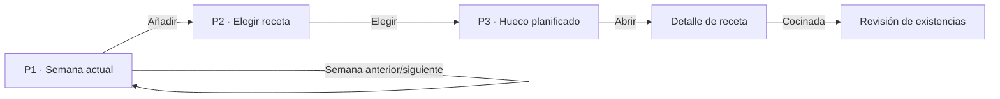

# Especificación de pantallas — Plan semanal

## Propósito

Ayudar al hogar a decidir comidas y cenas de la semana sin exigir una planificación completa de una vez. Plan es el destino inicial tras el onboarding y no compite con un dashboard.

## Estado de implementación

- P1, P2 y P3 están implementados: semana por lunes ISO, huecos de comida/cena, selección directa, búsqueda, cambio, raciones, mover, eliminar y Deshacer.
- P2 muestra hasta tres sugerencias deterministas cuando no hay búsqueda. Al elegir desde P2, los faltantes se consolidan en Compra y se informa el resultado sin bloquear el plan.
- **Marcar como cocinada** abre una revisión independiente (`/plan/cocinar`) desde el menú del hueco planificado. Cada descuento propuesto se confirma o corrige antes de modificar Despensa.
- **Delta pendiente de decisión:** la implementación devuelve como máximo tres sugerencias; [[MVP-FUNCTIONAL-BRIEF]] todavía exige exactamente tres. La Fase 9 debe decidir si se completa el número cuando existan menos candidatas o si el requisito pasa a «hasta tres».

## Flujo

## P1 — Semana actual

### Composición

1. Cabecera: título **Plan**, rango de la semana y navegación anterior/siguiente.
2. Resumen discreto: `Esta semana · {n} de 14 comidas planificadas`.
3. Siete días en orden temporal, con solo dos huecos: **Comida** y **Cena**.
4. Un hueco vacío presenta una sola acción: **Añadir**.
5. Un hueco ocupado muestra nombre de receta, tiempo y una acción contextual, sin botones adicionales.

### Reglas

- La semana actual se abre por defecto; volver de una receta mantiene fecha y desplazamiento.
- No hay vista mensual, métricas nutricionales ni recomendaciones persistentes.
- Una receta planificada se abre al pulsar el hueco; el menú contextual agrupa mover, cambiar raciones, sustituir y eliminar.
- **Marcar como cocinada** aparece en el menú contextual del hueco planificado y abre la revisión de consumos; no descuenta existencias desde la tarjeta.
- Cuando la semana tiene muchos huecos vacíos, el texto guía se muestra una vez: `Empieza por una comida que quieras resolver.`

## P2 — Elegir receta para un hueco

### Contexto visible

- Cabecera de retorno: `Añadir a · martes, comida`.
- H1: **¿Qué quieres comer?**
- Hasta tres sugerencias iniciales, cada una con una explicación breve: `Aprovecha {producto}`, `Lista en {tiempo}` o `Para variar esta semana`.
- Cada sugerencia indica su disponibilidad: `Puedes prepararla con lo que tienes` o `Necesitas comprar: {producto}, {producto}`.
- Acción secundaria: **Buscar una receta**.

### Estados

| Estado | Contenido | Acción |
| --- | --- | --- |
| Sugerencias | Hasta 3 recetas con motivo, tiempo y disponibilidad | Elegir receta |
| Búsqueda | Campo y resultados | Elegir receta |
| Sin resultados | Explicación breve | Ver todas las recetas |
| Sin recetas guardadas | Explicación y enlace a Recetas | Añadir receta |

### Reglas

- No se obliga a usar una sugerencia; buscar siempre está disponible.
- Las sugerencias se calculan automáticamente con reglas transparentes y usan únicamente la biblioteca de recetas guardada por el hogar; la aplicación no crea recetas nuevas ni completa el plan sin confirmación.
- Elegir una receta confirma directamente el hueco. La edición de raciones ocurre después, desde el menú contextual o el detalle.
- Al elegir una receta con ingredientes faltantes, estos se incorporan o consolidan en la sección **Para el plan** de la lista de Compra. Plan muestra una confirmación breve: `Hemos añadido {n} productos a Compra`.
- Si ninguna receta se puede preparar íntegramente con la despensa, las tres sugerencias se siguen mostrando y explican qué productos faltan; el usuario mantiene la decisión.
- Si se abandona P2, no se modifica el plan ni Compra.
- La lista de Compra se recalcula en segundo plano tras la selección; se comunica de forma discreta sin interrumpir.

## P3 — Hueco planificado

La representación dentro de P1 debe mostrar:

- nombre de la receta;
- tiempo total, si se conoce;
- raciones del plan, si difieren de la receta original;
- señal breve de que está planificada, no de que se ha cocinado.

El menú contextual incluye **Cambiar receta**, **Ajustar raciones**, **Mover** y **Eliminar**. Todas son secundarias. Eliminar solicita confirmación y ofrece **Deshacer**.

## Adaptación responsive

| Contexto | Distribución |
| --- | --- |
| Móvil | Lista vertical por días; comida y cena apiladas; navegación semanal en cabecera. |
| Tablet | Días más compactos en una cuadrícula de dos columnas, conservando el orden temporal. |
| Escritorio | Semana completa en una cuadrícula de siete columnas; cada columna mantiene comida sobre cena. |

En todos los tamaños, P2 se abre como vista independiente. No se abre un panel lateral de selección que reduzca en exceso la semana. El orden mental y los nombres permanecen idénticos.

## Estados compartidos

- **Plan vacío:** mensaje breve y una única CTA para abrir el primer hueco.
- **Semana parcial:** muestra lo planificado sin pedir completar todos los huecos.
- **Sincronizando:** estado discreto en cabecera; Plan sigue siendo legible.
- **Error al guardar:** conserva la selección local, identifica el hueco afectado y permite reintentar.
- **Cambio de otra persona:** actualiza el hueco sin cerrar una selección o un menú local.

## Criterios de aceptación

### UX-PLAN-001 — Añadir con contexto

Desde un hueco vacío, activar **Añadir** abre P2 indicando día y servicio. Al elegir una receta, se actualiza solo ese hueco. Verificación: revisión manual a 390 y 1440 px.

### UX-PLAN-002 — Sugerencias no obligatorias

P2 muestra hasta tres sugerencias y permite buscar sin seleccionar ninguna. Cada una identifica si usa existencias conocidas o qué productos faltan. Verificación: prueba manual de ambos caminos.

### UX-PLAN-005 — Faltantes consolidados

Al elegir una receta con ingredientes faltantes, esos productos aparecen una sola vez en la sección **Para el plan** de Compra, sin duplicar productos equivalentes ya presentes. Verificación: prueba P2 → Compra con una receta disponible y otra con faltantes.

### UX-PLAN-003 — Semana comprensible

Comida y cena se pueden identificar para los siete días sin scroll horizontal a 320 px ni ambigüedad visual a 1440 px. Verificación: revisión responsive.

### UX-PLAN-004 — Cambio reversible

Eliminar una planificación requiere confirmación y ofrece Deshacer sin afectar otros huecos. Verificación: prueba manual.
