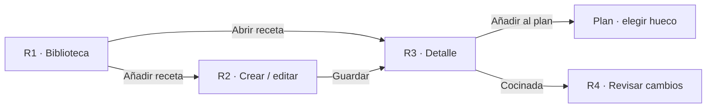

# Especificación de pantallas — Recetas

## Propósito

Ofrecer una biblioteca propia, fácil de recuperar y suficientemente estructurada para planificar y cocinar. La captura debe permitir empezar con poca información y mejorar la receta después.

## Flujo

## R1 — Biblioteca

### Composición

- H1: **Recetas**.
- Campo de búsqueda visible: `Busca una receta o ingrediente`.
- Lista de recetas con nombre, tipo de plato, tiempo y una señal discreta de disponibilidad cuando exista.
- CTA: **Añadir receta**.
- Filtros, etiquetas, enlace de origen y edición permanecen ocultos hasta que el usuario los solicite.

### Estados

| Estado | Contenido | Acción principal |
| --- | --- | --- |
| Con recetas | Búsqueda y lista | Añadir receta |
| Búsqueda sin resultado | Texto breve con término buscado | Añadir receta |
| Biblioteca vacía | `Guarda recetas para decidir más rápido.` | Añadir receta |
| Carga / error | Mantiene resultados previos si existen | Reintentar |

## R2 — Crear o editar receta

### Orden de captura

1. Nombre de la receta.
2. Raciones y tiempo total, ambos opcionales al inicio.
3. Ingredientes: nombre obligatorio por fila; cantidad y unidad opcionales.
4. Pasos: una lista de texto breve que puede crecer progresivamente.
5. Datos secundarios bajo **Más detalles**: tipo de plato, etiquetas y enlace de origen.

### Reglas

- Una receta con nombre se puede guardar aunque no tenga ingredientes o pasos completos.
- Un enlace de origen puede guardarse como referencia. Cuando se incorpore la lectura automática, sus ingredientes y pasos propuestos se revisan y corrigen antes de poder planificar con la receta.
- Cada ingrediente se añade en línea; no se abre un formulario por ingrediente.
- El primer paso de una receta nueva es `Añade el primer paso` y nunca una plantilla larga.
- Guardar conserva el borrador local ante un error de red y muestra un reintento claro.
- Eliminar una receta se realiza desde el menú contextual y requiere confirmación.

## R2A — Importar receta y revisar el resultado

Al pulsar **Añadir receta**, el usuario elige una única vía: **Pegar enlace**, **Subir una foto o captura** o **Crear manualmente**. En móvil la elección es una vista breve; en tablet y escritorio es un diálogo compacto. Crear manualmente conduce a R2.

### Entrada automática

1. Un enlace se analiza mediante datos `Recipe` estructurados cuando la página los ofrece; una imagen o captura se entrega al flujo de OCR.
2. Mientras se procesa, se muestra un estado breve de progreso y la acción **Cancelar**. No se crea ni altera una receta todavía.
3. El resultado se abre siempre en **Revisar receta**: nombre, raciones, tiempo, ingredientes, pasos y enlace o imagen de origen.
4. Los datos con lectura incierta se muestran como filas editables; los campos no reconocidos quedan vacíos, nunca inventados.
5. La CTA **Guardar receta** crea la receta solo después de la revisión. **Seguir editando** lleva a R2 sin perder los datos extraídos.

### Estados y reglas

| Estado | Mensaje | Acción |
| --- | --- | --- |
| Datos estructurados encontrados | `Hemos preparado la receta para revisarla.` | Revisar receta |
| Texto detectado parcialmente | `Revisa los campos marcados antes de guardar.` | Revisar receta |
| No se pudo leer | `Puedes crear la receta manualmente con el enlace o imagen como referencia.` | Crear manualmente |
| Enlace no compatible | `No encontramos datos de receta en este enlace.` | Crear manualmente |

- La automatización usa extracción de datos estructurados, OCR y parseo determinista; no usa modelos generativos.
- La imagen original y el texto detectado no actualizan Compra ni Despensa; se conservan solo con la receta que el usuario decida guardar.
- Un ingrediente sin nombre válido no se puede incluir en una receta planificable hasta que el usuario lo corrija.

## R3 — Detalle de receta

### Composición

- H1 y datos esenciales: raciones, tiempo y tipo si se conocen.
- Ingredientes estructurados y pasos en secuencia.
- CTA: **Añadir al plan**.
- Acción secundaria contextual: **Editar**.
- Cuando la receta se abre desde un hueco del Plan, la CTA adopta el contexto: **Añadir al martes, comida**.

### Ajuste de raciones

- El ajuste se abre desde raciones y muestra la equivalencia de ingredientes cuando sea posible.
- La receta original no se modifica: la planificación guarda el número de raciones elegido.
- Si faltan cantidades, se explica que algunos ingredientes no pueden ajustarse automáticamente.

## R4 — Cocinar y revisar existencias

- Solo se muestra al abrir una receta planificada.
- CTA: **Marcar como cocinada**.
- Al activarla se presenta una lista de cambios propuestos para productos conocidos.
- Cada cambio permite confirmar, corregir o ignorar; no existe descuento automático.
- Confirmar vuelve a Plan, actualiza Despensa y recalcula Compra si hace falta.

## Adaptación responsive

| Contexto | Biblioteca y detalle | Edición |
| --- | --- | --- |
| Móvil | R1 y R3 son vistas consecutivas | Una columna, CTA al final |
| Tablet | Lista y detalle pueden convivir | Ingredientes y pasos mantienen una sola columna |
| Escritorio | Lista a la izquierda y detalle a la derecha | Panel central limitado; datos secundarios en lateral solo cuando haya espacio |

El teclado, lector de pantalla y orden de edición se mantienen idénticos. En escritorio, el segundo panel evita navegar de vuelta a la biblioteca; no añade acciones nuevas.

## Criterios de aceptación

### UX-REC-001 — Captura progresiva

Con solo un nombre, el usuario puede guardar una receta y volver a editarla sin pérdida. Verificación: prueba manual con error de red simulado.

### UX-REC-002 — Ingredientes sin formularios repetidos

El usuario puede añadir diez ingredientes consecutivos sin abrir un formulario modal por cada uno. Verificación: prueba manual a 390 px.

### UX-REC-003 — Planificación contextual

Desde el detalle, añadir una receta al plan conserva el día y servicio elegidos cuando el origen es P2. Verificación: prueba P2 → R3 → Plan.

### UX-REC-004 — Existencias confirmadas

Marcar una receta como cocinada nunca modifica Despensa sin que se confirme o corrija cada cambio propuesto. Verificación: revisión manual de R4.

### UX-REC-005 — Importación revisable

Un enlace, foto o captura solo propone una receta editable; ningún ingrediente extraído genera Compra hasta que el usuario guarde la receta y la planifique. Verificación: pruebas con datos estructurados completos, lectura parcial y error de extracción.
