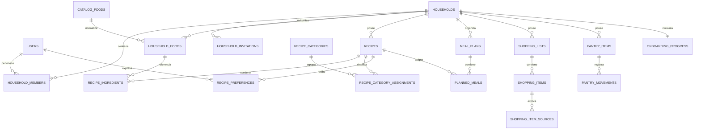

# Modelo de dominio y datos — MiDespensa

## 1. Propósito y estado

Definir un modelo relacional para el MVP que mantenga coherentes recetas, planificación, compra y despensa, con aislamiento por hogar, colaboración entre miembros, trazabilidad e idempotencia.

El modelo se materializó progresivamente en las migraciones de las Fases 0–8. Esta nota conserva la intención y las invariantes canónicas; los nombres físicos y el comportamiento ejecutable se verifican contra las migraciones y RPCs. La aceptación integral de los flujos sigue pendiente de la Fase 9.

## 2. Límites del dominio

El sistema se divide en estos módulos:

1. identidad y acceso;
2. hogares, miembros e invitaciones;
3. catálogo de alimentos y unidades;
4. recetas;
5. planificación semanal;
6. compra;
7. despensa y movimientos;
8. onboarding;
9. sugerencias explicables;
10. sincronización, auditoría e idempotencia.

Los módulos comparten una sola base PostgreSQL durante el MVP, pero cada uno conserva sus reglas y casos de uso. No se crean microservicios ni bases independientes.

## 3. Modelo de pertenencia y autorización

- `auth.users` representa la identidad autenticada; `profiles` contiene únicamente los datos de aplicación necesarios.
- `households` representa el único espacio compartido de la aplicación y es la raíz de los datos privados.
- `household_members` relaciona usuarios y hogares con rol `owner` o `member`.
- El sistema admite exactamente un hogar y un máximo de dos membresías activas. No se prepara el esquema ni la interfaz para múltiples hogares o crecimiento de usuarios.
- Toda fila privada lleva `household_id`, incluso cuando pueda derivarse mediante otra relación.
- Las claves foráneas compuestas incluyen `household_id` para impedir relaciones accidentales entre hogares.
- Las políticas de base de datos comprueban membresía para lectura y escritura; las acciones administrativas exigen el rol `owner`.
- Ningún permiso depende solo de ocultar controles en la interfaz.

## 4. Vista de entidades

## 5. Entidades principales

### Identidad y hogar

| Entidad | Responsabilidad | Campos y restricciones relevantes |
| --- | --- | --- |
| `profiles` | Perfil mínimo de una identidad | `user_id`, nombre visible, preferencias no sensibles |
| `households` | Raíz del espacio compartido | nombre, creador, estado de onboarding, `baseline_confirmed_at` |
| `household_members` | Membresía y autorización | `household_id`, `user_id`, rol, estado, fechas; pertenencia única por pareja hogar/usuario |
| `household_invitations` | Incorporación inicial de la segunda cuenta | destinatario normalizado, hash del token, caducidad, revocación y aceptación; como máximo una incorporación activa |

Los tokens de incorporación nunca se almacenan en claro. La aceptación bloquea la reutilización, se ejecuta de forma atómica y rechaza cualquier intento de superar dos miembros activos.

### Catálogo y unidades

| Entidad | Responsabilidad |
| --- | --- |
| `catalog_foods` | Alimentos canónicos globales y categoría alimentaria |
| `food_aliases` | Sinónimos usados para búsqueda y consolidación |
| `household_foods` | Nombre que utiliza un hogar, enlazado opcionalmente a un alimento canónico |
| `units` | Unidades y familia de medida: unidades, masa o volumen |
| `unit_conversions` | Solo conversiones explícitas dentro de una misma familia |

Recetas, compra y despensa referencian `household_foods`. Esta capa permite nombres personalizados sin perder la normalización necesaria para consolidar. No se convierten unidades incompatibles ni se fusionan coincidencias ambiguas.

### Recetas

| Entidad | Responsabilidad |
| --- | --- |
| `recipes` | Receta privada del hogar, raciones base, tiempos, origen, procedencia y estado |
| `recipe_ingredients` | Alimento, cantidad, unidad, orden y nota no cuantificable |
| `recipe_steps` | Pasos ordenados |
| `recipe_categories` | Taxonomía controlada por dimensión: tipo de plato, ingrediente principal, técnica, tiempo, temporada u orientación mediterránea |
| `recipe_category_assignments` | Relación muchos-a-muchos entre recetas y categorías |
| `recipe_preferences` | Favorito y puntuación opcional de 1 a 5 para cada persona y receta |

Una receta puede estar `pending` con solo nombre y enlace, o `ready`. Solo las recetas `ready` pueden alimentar consolidaciones y sugerencias basadas en ingredientes.

Las recetas iniciales se importan dentro del hogar y después son editables. `recipes` conserva `origin`, `seed_key`, `seed_version`, autor o responsable, URL de fuente, identificador y URL de licencia, atribución y notas de derechos. `seed_key` es único y hace idempotente la carga; una actualización del dataset no sobrescribe silenciosamente una receta modificada por el hogar.

Cada fila de `recipe_preferences` es única por `user_id` y `recipe_id`. `is_favorite` es booleano y `rating` admite `NULL` o un entero de 1 a 5. Las preferencias se mantienen por persona y se agregan únicamente al calcular recomendaciones para el menú compartido.

### Ranking de recetas

El ranking será determinista y explicable. Primero excluye recetas incompletas o incompatibles con el hueco y después combina:

- cobertura de ingredientes disponibles;
- productos que conviene consumir;
- favorito y puntuación de cada persona, con contribución limitada para evitar que una sola preferencia domine;
- variedad de categorías en la semana;
- adecuación general al patrón mediterráneo;
- tiempo de preparación;
- penalización por repetición reciente y por productos faltantes.

Los pesos se configuran como parámetros versionados, no como valores dispersos en el código. El resultado conserva los factores que más influyeron para mostrar hasta tres motivos comprensibles.

### Planificación

| Entidad | Responsabilidad |
| --- | --- |
| `meal_plans` | Semana de un hogar, identificada por la fecha local de inicio |
| `planned_meals` | Comida o cena de una fecha, receta y raciones |

Existe como máximo una asignación por hogar, fecha y tipo de comida. Duplicar una semana copia valores; no crea vínculos vivos ni copia compras o consumos.

### Compra

| Entidad | Responsabilidad |
| --- | --- |
| `shopping_lists` | Lista compartida y su ciclo `active` → `reviewing` → `completed` |
| `shopping_items` | Producto consolidado o manual, cantidad, unidad, tienda y estado |
| `shopping_item_sources` | Origen trazable: ingrediente planificado, entrada manual u otro ítem permitido |
| `stores` | Supermercados opcionales definidos por el hogar |

La regeneración recalcula únicamente las fuentes derivadas del plan, preserva los productos manuales y no fusiona unidades incompatibles. Finalizar una compra crea movimientos de despensa una sola vez.

### Despensa

| Entidad | Responsabilidad |
| --- | --- |
| `pantry_locations` | Frigorífico, congelador, despensa/armario y futuras ubicaciones |
| `pantry_items` | Fotografía actual de un alimento y su modo de seguimiento |
| `pantry_movements` | Historial inmutable de entradas, consumos, correcciones y cambios aproximados |

`pantry_items` admite tres modos:

- `approximate`: presencia o estado cualitativo;
- `units`: número de unidades;
- `measure`: masa o volumen con unidad compatible.

La cantidad es opcional en modo aproximado y nunca puede quedar negativa. Cada estado guarda `confirmed_at`, `confirmed_by`, `version` y la procedencia de la última confirmación. “Consumir pronto” es una evaluación derivada por categoría y antigüedad; no es una caducidad almacenada.

### Onboarding

| Entidad | Responsabilidad |
| --- | --- |
| `onboarding_progress` | Paso actual, estado general y última confirmación del hogar |
| `onboarding_zone_progress` | Estado de frigorífico, congelador y despensa/armario |

Cada cambio del informe inicial actualiza la despensa y el progreso en una sola transacción. Confirmar la línea base exige que las tres zonas estén completadas o declaradas vacías y registra `baseline_confirmed_at`.

### Operación y futuro OCR

| Entidad | Responsabilidad |
| --- | --- |
| `idempotency_keys` | Resultado estable de comandos reintentables, limitado por hogar, actor y operación |
| `audit_events` | Evidencia mínima de acciones administrativas y mutaciones críticas |
| `import_batches` | Lote futuro de OCR o parseo sin efectos sobre datos confirmados |
| `import_candidates` | Valores detectados, procedencia, confianza y corrección propuesta |

Los candidatos importados solo modifican recetas, compra o despensa después de una confirmación explícita. La confianza del OCR nunca se copia como si fuera certeza del hogar.

## 6. Reglas de consistencia

1. Toda mutación crítica se ejecuta en servidor y dentro de una transacción.
2. La clave de idempotencia se valida junto con un hash de la petición; reutilizar una clave con otro contenido se rechaza.
3. `pantry_items` y su `pantry_movement` se actualizan juntos.
4. Confirmar una compra o una receta cocinada no puede producir dos movimientos ante reintentos.
5. Las cantidades exactas no admiten valores negativos.
6. Los datos de dos hogares no pueden relacionarse mediante claves foráneas.
7. Las ediciones colaborativas usan control optimista mediante `version`; un conflicto devuelve el estado reciente para revisión.
8. Realtime notifica cambios, pero PostgreSQL sigue siendo la fuente de verdad.
9. Las fechas técnicas se guardan en UTC; las semanas y comidas conservan la zona horaria del hogar.
10. El borrado recuperable y la duración del historial se concretarán cuando exista una política de retención aprobada.

## 7. Operaciones que requieren idempotencia

- aceptar una invitación;
- confirmar la despensa inicial;
- duplicar una semana;
- regenerar una lista de compra;
- finalizar una compra e incorporar productos;
- confirmar una receta cocinada;
- registrar un consumo o una corrección de despensa;
- aplicar una futura importación de receta o ticket.

## 8. Estrategia de sincronización

- Las escrituras confirmadas publican cambios después de completar la transacción.
- Los clientes suscritos invalidan y vuelven a consultar el recurso afectado; no reconstruyen el estado únicamente con eventos.
- `version` permite detectar una edición basada en datos antiguos.
- Los estados pendientes del cliente muestran que todavía no existe confirmación del servidor.
- El MVP no garantiza edición completa sin conexión; conserva borradores y permite reintentar operaciones idempotentes.

## 9. Índices y controles mínimos

- Índices por `household_id` en todas las tablas privadas.
- Unicidad compuesta para membresías, semana del hogar, hueco de comida e ítem de despensa por ubicación.
- Índices por estado para lista activa, onboarding e importaciones pendientes.
- Restricciones `CHECK` para cantidades, roles, estados y familias de unidad.
- Pruebas negativas con una identidad ajena y con un intento de tercera cuenta para cada módulo privado.
- Pruebas de concurrencia con dos sesiones para compra y despensa.
- Pruebas de reintento para toda operación incluida en la sección 7.

## 10. Decisiones pendientes

1. Método de registro e inicio de sesión.
2. Política visible y técnica de retención de movimientos, auditoría y borrados recuperables.
3. Vocabulario final de estados aproximados de despensa.
4. Nivel de edición simultánea: rechazo con recarga o fusión campo a campo; se recomienda rechazo explícito para el MVP.
5. Tamaño objetivo y reparto por categorías del dataset inicial.
6. Pesos iniciales del ranking y periodo usado para penalizar repeticiones.

## 11. Criterios de aceptación del modelo

- [x] Incluye el único hogar, sus dos cuentas, la incorporación inicial y sus permisos.
- [x] Incluye recetas, ingredientes, raciones, unidades, categorías, favoritos y puntuaciones.
- [x] Incluye planificación, compra, existencias y movimientos.
- [x] Distingue datos confirmados, estimados, sugeridos e importados.
- [x] Define autorización cerrada, concurrencia, idempotencia y carga versionada del dataset inicial.
- [x] Prepara OCR futuro sin contaminar los datos confirmados.
- [ ] Las decisiones pendientes han sido revisadas y aceptadas.
- [ ] El modelo lógico se ha traducido a esquema SQL y políticas RLS verificadas.
