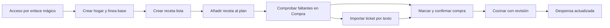

# Diseño E2E — Validación del hogar fundador

## Propósito

Definir una validación automatizada que recorra el valor completo de MiDespensa como lo haría una persona del hogar: entrar, crear una base útil, planificar, comprar, confirmar, cocinar y actualizar la despensa. La suite detecta fallos funcionales, incoherencias entre pantallas y señales objetivas de fricción; no suplanta la validación cualitativa en un móvil físico.

## Límites y seguridad

- Solo contra Supabase local y datos sintéticos efímeros.
- Cada ejecución crea un correo `founder-e2e-<timestamp>@example.test`, un hogar y sus datos; los elimina al terminar incluso si falla el recorrido.
- Nunca usa la cuenta local persistente `admin`, producción, tickets reales ni credenciales del hogar.
- La cámara, permisos del dispositivo y precisión de OCR con fotografías reales se validan manualmente en móvil. La automatización cubre la importación por texto y la revisión humana resultante.

## Recorrido de valor

## Cobertura obligatoria de acciones

El recorrido de valor no sustituye a la cobertura de acciones. Cada fila siguiente debe tener al menos una prueba E2E propia, con resultado visible, persistencia comprobada y limpieza del dato sintético.

| Área | Acción que se prueba | Resultado que el agente debe comprobar |
| --- | --- | --- |
| Despensa | Añadir un producto por presencia | El producto aparece en la zona correcta sin solicitar ni mostrar cantidades. |
| Despensa | Marcar `Se terminó` y deshacer | El producto desaparece de la lista activa; deshacer recupera su presencia sin sobrescribir cambios remotos. |
| Despensa → Compra | Añadir un producto terminado a Compra | Compra contiene una sola línea trazable y Despensa conserva una única acción de salida: `Se terminó`. |
| Compra | Añadir artículo manual, marcar y desmarcar comprado | El progreso y la marca cambian de inmediato y permanecen tras recargar. |
| Compra | Abrir revisión de compra, volver y confirmar | Volver conserva las marcas; confirmar actualiza Despensa una única vez y retira los artículos comprados. |
| Compra | Importar ticket por texto, editar una línea y excluir otra | Nada cambia antes de confirmar; solo las líneas incluidas llegan marcadas como compradas. |
| Recetas | Crear receta rápida desde la biblioteca | La tarjeta aparece en la biblioteca y abre el editor correcto. |
| Recetas | Crear una receta completa con ingredientes, pasos y detalles | Guardar conserva los datos, el orden de pasos y deja la receta elegible para el plan. |
| Recetas | Editar una receta existente y guardar | El detalle y la biblioteca muestran los cambios sin crear un duplicado. |
| Recetas | Capturar enlace como receta pendiente y completarla | Permanece `pending` hasta la revisión; al completarla pasa a `ready`. |
| Recetas | Favorito, puntuación y categorías | El estado individual se conserva y los filtros lo encuentran. |
| Plan | Añadir una receta a un hueco desde el selector | El hueco queda ocupado, vuelve a la semana y se consolidan faltantes solo una vez. |
| Plan | Abrir opciones de una comida planificada | Las opciones disponibles corresponden a un hueco ocupado y no ocultan la receta. |
| Plan | Cambiar receta, ajustar raciones, mover, eliminar y deshacer | Se actualiza exclusivamente el hueco objetivo; mover no pierde la comida y deshacer restaura el mismo estado. |
| Plan → Cocina | Marcar una receta como cocinada con revisión de productos terminados | La comida se marca una vez; Despensa solo retira los productos que la persona confirma como terminados. |

## Especificación de la suite

### 1. `founder-journey.spec.ts`

Ejecuta el recorrido principal en un contexto de navegador nuevo y verifica, tras cada decisión, el resultado visible y el estado persistido correspondiente.

| Etapa | Acción de la persona | Garantía E2E |
| --- | --- | --- |
| Acceso | Solicitar y abrir el enlace mágico de Mailpit | Se conserva la sesión y se llega al onboarding. |
| Línea base | Crear hogar y declarar una presencia por zona | Se puede confirmar la línea base y se entra en el área principal. |
| Receta | Crear una receta `ready` con ingredientes y pasos | La tarjeta aparece, es navegable y se puede elegir desde Plan. |
| Plan | Asignar la receta a un hueco | El hueco queda ocupado y los faltantes se muestran en Compra sin duplicados. |
| Compra | Marcar faltantes y confirmar | La revisión explica el efecto y el producto llega a Despensa una sola vez. |
| Cocina | Marcar la comida como cocinada y confirmar propuestas | La comida queda cocinada y Despensa refleja el estado confirmado. |
| Ticket | Pegar líneas de ticket, corregir una y confirmar | Nada cambia antes de confirmar; las líneas aparecen como compradas y usan el cierre C2 existente. |

### 2. `founder-actions.spec.ts`

Ejecuta la matriz anterior por módulos para que un fallo indique la acción exacta que se ha roto. Los casos no dependen del orden de ejecución: cada `describe` crea las recetas, productos y huecos que necesita, y nunca reutiliza una mutación de otro caso.

- `pantry`: alta por presencia, `Se terminó`, deshacer y puente a Compra; no se prueban cantidades ni otros estados porque no forman parte de la experiencia.
- `shopping`: alta manual, marca, desmarca, progreso, revisión, volver, confirmación e importación de ticket por texto.
- `recipes`: alta rápida, editor completo, edición, guardado, enlace pendiente, categorías y preferencias.
- `plan`: selector, cambio, raciones, mover, eliminar, deshacer y cocinado con revisión editable.

El agente toma una captura antes y después de cada mutación irreversible y verifica tanto el mensaje de interfaz como el estado que se consulta de nuevo desde la pantalla afectada.

### 3. `founder-ux-audit.spec.ts`

Recorre las rutas representativas en `390×844`, `768×1024` y `1440×1000` con fixtures deterministas. No decide si un diseño es bonito; registra señales reproducibles que requieren revisión humana.

| Señal | Regla automática | Severidad |
| --- | --- | --- |
| Error técnico | Error de consola o respuesta `4xx/5xx` no esperada | Bloqueante |
| Pérdida de flujo | Ruta distinta a la prevista, bucle de redirección o estado confirmado no visible | Bloqueante |
| Desbordamiento | `scrollWidth > innerWidth` fuera de elementos con scroll intencional | Alta |
| Objetivo táctil | Control primario visible menor de 44 px en móvil | Alta |
| Semántica | Botón, enlace o campo sin nombre accesible | Alta |
| Foco | La navegación por teclado no produce un elemento visible enfocado | Alta |
| Salida clara | Pantalla sin encabezado, sin acción principal ni retorno cuando el recorrido lo requiere | Candidata de mejora |
| Fricción | Más decisiones que el presupuesto del flujo o CTA primaria no visible sin scroll inicial | Candidata de mejora |

Cada hallazgo incluye URL, viewport, captura, traza y recomendación concreta. Las candidatas no bloquean una release: pasan a revisión humana y solo se convierten en incidencia si una persona confirma el problema.

### 4. `founder-realtime.spec.ts`

Reutiliza el patrón de dos sesiones existente para verificar que un cambio de Compra, Plan o Despensa de una persona se actualiza en la otra sin recargar y sin sobrescribir una acción local. Este alcance se ejecuta con una cuenta sintética separada del recorrido principal.

## Infraestructura y comandos previstos

- Extender `scripts/run-e2e-auth.mjs` para cargar las credenciales locales, iniciar Next en un puerto aislado y seleccionar la suite solicitada.
- Añadir `npm run test:e2e:founder` para el recorrido principal, `npm run test:e2e:actions` para la matriz completa y `npm run test:e2e:ux` para la auditoría visual/semántica.
- Playwright conserva `trace`, captura y vídeo al fallar; el reporte HTML y un resumen JSON se guardan bajo `test-results/founder-e2e/` y no se versionan.
- La suite usa selectores por rol, nombre accesible y texto de producto; no selectores CSS de presentación ni esperas fijas.

## Informe para el agente

Al terminar, el agente publica un resumen con:

1. Estado por etapa: superada, fallida o no aplicable.
2. Incidencias bloqueantes y altas con enlace al artefacto reproducible.
3. Candidatas de mejora separadas de los defectos, con la señal que las originó.
4. Deltas de datos esperados: receta, hueco del plan, artículos de Compra, movimientos y estado de cocinado.
5. Límites de la ejecución: pruebas físicas pendientes de cámara, permisos, rendimiento percibido y precisión OCR.

## Criterio de salida de Validación

La fase puede proponerse para cierre cuando el recorrido principal y el de dos sesiones estén en verde, no existan hallazgos bloqueantes o altos sin decisión, y la persona responsable haya completado la prueba física de ticket en móvil.
