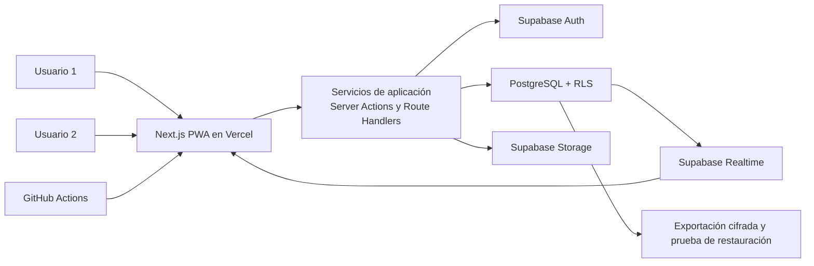

# Arquitectura técnica del MVP web — MiDespensa

## 1. Decisión aceptada

Construir MiDespensa como un **monolito modular web** en un único repositorio y despliegue:

- Next.js con App Router, React y TypeScript para interfaz, rutas y lógica de aplicación;
- Supabase para PostgreSQL, autenticación, Realtime y almacenamiento;
- Vercel Hobby para alojar la aplicación mientras el uso sea personal y no comercial;
- GitHub Actions para verificar cada cambio;
- PWA instalable, móvil primero, sin prometer funcionamiento completo sin conexión.

Esta solución está dimensionada deliberadamente para un hogar y dos cuentas. No se introducen microservicios, colas, Kubernetes, cachés distribuidas ni componentes preparados para una escala que el producto no tendrá.

## 2. Restricciones que gobiernan la arquitectura

- Un único hogar y exactamente dos cuentas autorizadas como máximo.
- Sin registro público ni necesidad de crecimiento multiusuario.
- Tráfico y volumen de datos muy bajos.
- Presupuesto inicial objetivo de 0 € al mes.
- Datos compartidos que deben sincronizarse entre dos dispositivos.
- Sugerencias de recetas deterministas y explicables; no requieren IA generativa en ejecución.
- Interfaz móvil primero, accesible y rápida en conexiones domésticas.
- Seguridad basada en autorización del servidor y base de datos, no en controles ocultos de la interfaz.

## 3. Vista del sistema

El navegador nunca recibe la clave de servicio. Las operaciones críticas atraviesan servicios de aplicación que validan identidad, pertenencia, versión e idempotencia y ejecutan una transacción en PostgreSQL.

## 4. Componentes y responsabilidades

| Componente | Responsabilidad |
| --- | --- |
| Next.js PWA | Pantallas, navegación, caché del shell, formularios y estado pendiente |
| Servicios de aplicación | Casos de uso, validación de entrada, autorización contextual y errores tipados |
| PostgreSQL | Fuente de verdad, relaciones, restricciones, transacciones e historial |
| Supabase Auth | Inicio de sesión de las dos identidades permitidas y sesiones |
| Row Level Security | Defensa adicional: toda consulta privada exige membresía del hogar |
| Supabase Realtime | Avisar de cambios para invalidar y volver a consultar datos |
| Supabase Storage | Imágenes propias de recetas y futuras capturas para importación |
| GitHub Actions | Lint, tipos, pruebas, migraciones y controles de seguridad |

Los módulos del monolito son: identidad y hogar, catálogo, recetas, planificación, compra, despensa, onboarding y recomendaciones. Se relacionan mediante casos de uso explícitos y una única base de datos; no se llaman entre sí por HTTP.

### Contrato de implementación visual

Claude y Codex definen y realizan el diseño UI/UX directamente en el repositorio a partir de los requisitos de Obsidian y de los componentes y tokens existentes. La evidencia visual se conserva en [[VISUAL-CONTEXT]] a 390, 768 y 1440 px cuando aplique.

Antes de implementar una pantalla, el agente debe leer la especificación de Obsidian y el contexto visual ejecutado disponible. Obsidian y la arquitectura definen comportamiento, seguridad y límites de alcance; el repositorio implementa la UI y `VISUAL-CONTEXT` documenta su resultado.

## 5. Acceso y seguridad

1. Provisionar manualmente las dos cuentas mediante enlace mágico u OTP por correo.
2. Desactivar el alta pública después del aprovisionamiento.
3. Mantener una lista cerrada de correos autorizados y rechazar una tercera membresía mediante transacción y restricción de base de datos.
4. Incluir `household_id` en todos los datos privados y aplicar políticas RLS de lectura y escritura.
5. Reservar la clave `service_role` al servidor y a tareas administrativas controladas; nunca exponerla con variables públicas.
6. Validar entradas en el límite del servidor, limitar tipos y tamaños de archivo y usar URLs firmadas para contenido privado.
7. No registrar tokens, ingredientes privados, correos completos ni cuerpos de peticiones en logs.
8. Probar explícitamente acceso ajeno, intento de tercera cuenta y escalada de rol.

Para dos personas no necesitamos un sistema complejo de invitaciones recurrentes. Basta una incorporación inicial de la segunda cuenta, de un solo uso y revocable.

## 6. Persistencia, API y concurrencia

- El esquema se mantiene mediante migraciones SQL versionadas; los tipos TypeScript se generan desde PostgreSQL.
- Se usa el cliente oficial de Supabase y SQL/RPC transaccional; no se añade un ORM pesado al inicio.
- Consultas simples pueden ejecutarse con la sesión del usuario y RLS. Comandos críticos usan Server Actions o Route Handlers y funciones transaccionales.
- Cada comando reintentable acepta una clave de idempotencia y un hash de la petición.
- Las filas colaborativas relevantes usan `version` para control optimista. Un conflicto devuelve el estado reciente en vez de sobrescribirlo.
- Realtime sirve como aviso. El cliente invalida y vuelve a consultar; el evento no sustituye a la base de datos.
- El ranking de recetas vive en el módulo de recomendaciones, recibe pesos versionados y devuelve puntuación más motivos legibles.

## 7. Estrategia de conexión inestable

La aplicación cachea recursos estáticos y conserva borradores locales pequeños. Una escritura no se muestra como confirmada hasta recibir respuesta del servidor. Si falla la red, el usuario puede reintentar la misma operación con su clave de idempotencia.

No se implementará en el MVP una réplica completa de PostgreSQL en el dispositivo ni fusión automática de ediciones offline. Para dos usuarios, el coste y los estados ambiguos superarían el beneficio.

## 8. Entornos y entrega

| Entorno | Propósito | Datos |
| --- | --- | --- |
| Local | Desarrollo y pruebas de migraciones | Supabase local y dataset sintético |
| Preview | Revisar cada rama o pull request | Proyecto aislado o datos sintéticos; nunca producción |
| Producción | Uso real de las dos cuentas | Proyecto Supabase europeo dedicado |

El entorno de desarrollo remoto está creado en Supabase como `TuDespensa Development`, referencia `ibubyiqfmujazblgcbps`, región `eu-west-1`. Está vacío, usa PostgreSQL 17 y solo admite datos sintéticos. Sus URL y claves se gestionarán exclusivamente mediante variables de entorno; no se almacenan en este repositorio.

Flujo de entrega:

1. GitHub ejecuta formato, lint, TypeScript y pruebas unitarias.
2. Se validan migraciones desde cero, políticas RLS y casos de integración.
3. Vercel genera una preview sin secretos de producción cuando proceda.
4. La rama principal despliega producción después de superar verificaciones.

Los secretos se configuran por entorno. `.env.example` documenta nombres, nunca valores. Las dependencias se actualizan de forma controlada y se revisan con auditoría antes de publicar.

## 9. Copias de seguridad y recuperación

El plan gratuito de Supabase no debe considerarse una copia de seguridad gestionada. Para el MVP:

- exportación cifrada semanal de PostgreSQL y antes de cada migración destructiva;
- cuatro copias rotativas guardadas fuera del proyecto Supabase;
- inventario separado de imágenes del Storage;
- prueba de restauración trimestral en un entorno vacío;
- procedimiento escrito para recrear esquema, restaurar datos y validar las dos cuentas.

Si se necesita recuperación automática, mayor disponibilidad o menor intervención manual, el primer gasto recomendado es subir Supabase a un plan con copias gestionadas; no añadir más infraestructura propia.

## 10. Rendimiento, accesibilidad y operación

- Renderizado y carga diferida por ruta; imágenes optimizadas y paginación del recetario.
- Evitar JavaScript de terceros y peticiones repetidas; consultar solo columnas necesarias.
- Objetivo inicial: contenido principal visible en menos de 2,5 s sobre un móvil medio y acciones habituales con respuesta percibida inmediata.
- Navegación por teclado, foco visible, etiquetas accesibles, contraste suficiente y zoom sin pérdida de funcionalidad.
- Registro mínimo de errores con identificador de correlación, sin datos personales; comprobación sencilla de disponibilidad.
- Alertas de cuota de Vercel y Supabase y revisión mensual del uso, aunque solo existan dos usuarios.

## 11. Alojamiento y coste

| Opción | Coste inicial | Encaje |
| --- | ---: | --- |
| Vercel Hobby + Supabase Free | 0 €/mes | Recomendación para este proyecto personal y no comercial; integración Next.js sencilla |
| Cloudflare Workers + Supabase Free | 0 €/mes dentro de cuotas | Alternativa si cambia la condición de uso de Vercel o se prefiere más control; requiere adaptar Next.js con OpenNext |
| Netlify + Supabase Free | 0 €/mes dentro de créditos | Viable, pero aporta menos ventaja para este stack |
| Servidor propio/VPS | Coste y mantenimiento | Descartado: seguridad, parches y copias recaerían en nosotros |

El dominio propio y un proveedor de correo transaccional son opcionales y pueden romper el coste cero. La seguridad no depende de pagar: depende de cerrar el registro, configurar RLS, proteger secretos, aplicar actualizaciones y comprobar las copias. El plan gratuito sí ofrece menos garantías operativas y puede suspender proyectos inactivos.

## 12. Alternativas descartadas

- **Microservicios:** multiplican despliegues, secretos y fallos sin aislar una carga real.
- **Firebase como persistencia principal:** su modelo documental complica relaciones y transacciones entre recetas, plan, compra y despensa.
- **Backend dedicado separado:** duplica infraestructura; Next.js cubre los límites HTTP necesarios y PostgreSQL concentra invariantes.
- **Render gratuito para base de datos:** sus límites de caducidad y recuperación no encajan con datos domésticos duraderos.
- **IA generativa para recomendar menús:** añade coste, variabilidad y problemas de explicación; el ranking determinista cubre la necesidad inicial.

## 13. Riesgos y disparadores de cambio

| Riesgo | Mitigación o disparador |
| --- | --- |
| Pausa o pérdida del proyecto gratuito | Exportaciones cifradas y restauración probada; subir a Supabase de pago si la continuidad se vuelve prioritaria |
| Restricción de uso no comercial de Vercel Hobby | Mantener despliegue portable y migrar a Cloudflare si el proyecto se comercializa |
| Error de RLS | Políticas por tabla, pruebas negativas automatizadas y ninguna clave privilegiada en cliente |
| Conflictos entre los dos usuarios | Control optimista, aviso de conflicto y recarga del estado reciente |
| Dependencia de proveedor | SQL estándar, migraciones propias, archivos exportables y almacenamiento sin lógica de negocio propietaria |

El número de usuarios no es un disparador de escalado: permanecerá en dos. Los cambios de arquitectura solo se justifican por coste, condiciones comerciales, fiabilidad o una necesidad funcional demostrada.

## 14. Decisiones formales aceptadas

Las cuatro decisiones se han aprobado y registrado:

1. [[0001-monolito-modular-nextjs|ADR-0001: monolito modular con Next.js]];
2. [[0002-supabase-postgresql|ADR-0002: Supabase/PostgreSQL como plataforma de datos]];
3. [[0003-vercel-hobby-cloudflare-salida|ADR-0003: Vercel Hobby inicial y Cloudflare como salida]];
4. [[0004-acceso-cerrado-rls|ADR-0004: autenticación cerrada para dos cuentas con RLS]].

El método concreto de correo de acceso y la ubicación operativa de las copias cifradas se concretarán al preparar el entorno, sin crear credenciales en esta fase.

## 15. Criterios de aceptación

- [x] Define frontend, backend, persistencia y despliegue.
- [x] Sitúa la autorización por hogar en servidor y PostgreSQL.
- [x] Define sincronización entre dispositivos y fuente de verdad.
- [x] Define transacciones, control de concurrencia, reintentos e idempotencia.
- [x] Incluye accesibilidad, rendimiento móvil, observabilidad y recuperación.
- [x] Compara alternativas y explica por qué no se usan.
- [x] Las cuatro decisiones arquitectónicas han sido aprobadas y registradas como ADR.
- [x] Se ha ejecutado una prueba de concepto de autenticación, RLS y Realtime con dos sesiones.

## 16. Protocolo de prueba técnica mínima

La prueba se ejecutará en un proyecto Supabase de desarrollo, con datos sintéticos y dos correos controlados. No se usarán los datos domésticos ni el proyecto de producción.

| Escenario | Acción | Resultado esperado |
| --- | --- | --- |
| Acceso autorizado | Iniciar sesión con las dos cuentas aprovisionadas | Ambas ven el mismo hogar y sus datos |
| Acceso ajeno | Usar una tercera identidad sin membresía | No puede leer ni escribir filas privadas |
| Límite de miembros | Intentar crear o aceptar una tercera membresía | La transacción se rechaza sin cambiar datos |
| Sincronización | Cambiar un elemento de compra o despensa desde la cuenta A | La cuenta B recibe aviso, vuelve a consultar y muestra el estado confirmado |
| Conflicto | Editar la misma fila desde ambas cuentas con una versión antigua | La segunda escritura recibe conflicto y conserva el estado reciente |
| Reintento | Reenviar una operación crítica con la misma clave de idempotencia | Se devuelve el resultado inicial sin duplicar movimientos |

La prueba se considerará superada solo con evidencia automatizada o capturas reproducibles de los seis escenarios. Después se podrá crear el proyecto de producción y aprovisionar las dos cuentas reales.

## 17. Resultado de la prueba de base de datos y extremo a extremo

La capa de PostgreSQL del POC ha superado los seis escenarios con identidades JWT sintéticas, RLS, concurrencia, idempotencia y publicación Realtime. La evidencia completa está en [[POC-TDD-EVIDENCE]].

La prueba final de extremo a extremo también está superada: `e2e/onboarding-two-sessions.spec.ts` inicia dos sesiones mediante magic link en Mailpit y verifica la convergencia Realtime en ambos sentidos. La evidencia se ejecutó en la Fase 2 sobre datos sintéticos y completa el criterio global de Auth, RLS y Realtime.
